# Data Flow Diagram - Bronze → Silver → Gold

**Purpose**: Comprehensive visualization of the medallion architecture data pipeline showing all data sources, transformations, and outputs.

**Related**: [STORY-011](agile/stories/active/STORY_011_data_flow_diagram.md) | [MEDALLION_ARCHITECTURE.md](MEDALLION_ARCHITECTURE.md) | [ARCHITECTURE.md](ARCHITECTURE.md)

---

## Complete Data Flow: Source to Analytics

This diagram shows the complete data pipeline across all three layers of the medallion architecture, including:
- **3 primary data sources**: House Clerk, Congress.gov API, Senate LDA
- **Data volumes**: ~5,000 PDFs per year, ~100,000 transactions total
- **File formats**: ZIP → PDF → Parquet → JSON
- **Transformations**: Extraction, normalization, enrichment, aggregation

```mermaid
flowchart TB
    %% ========================================
    %% DATA SOURCES
    %% ========================================
    subgraph Sources["📥 External Data Sources"]
        direction TB
        HC["<b>House Clerk Website</b><br/>disclosures-clerk.house.gov<br/><br/>📦 Annual ZIP files (100-500 MB)<br/>📄 XML index (~5K filings/year)<br/>📑 PDFs (15+ years of history)"]
        
        CG["<b>Congress.gov API</b><br/>api.congress.gov<br/><br/>👥 Member data (bioguide)<br/>📜 Bills & legislation<br/>🤝 Cosponsors<br/>🗳️ Votes"]
        
        LDA["<b>Senate LDA Database</b><br/>Lobbying disclosures<br/><br/>🏛️ Quarterly filings<br/>📋 XML format<br/>💼 Lobbyist registrations"]
    end

    %% ========================================
    %% BRONZE LAYER - RAW DATA
    %% ========================================
    subgraph Bronze["🥉 BRONZE LAYER - Raw/Immutable Storage"]
        direction TB
        
        subgraph BronzeHouse["House Financial Disclosures"]
            BZ["<b>ZIP Archives</b><br/>s3://.../bronze/house/financial/raw_zip/<br/><br/>Format: ZIP<br/>Size: 100-500 MB/year<br/>Retention: 7 years → Glacier"]
            
            BX["<b>Index Files</b><br/>s3://.../bronze/house/financial/index/<br/><br/>Format: XML + TXT<br/>Records: ~5,000 filings/year<br/>Contains: doc_id, member, filing_type"]
            
            BP["<b>PDF Documents</b><br/>s3://.../bronze/house/financial/pdfs/<br/><br/>Format: PDF<br/>Partitions: year/filing_type/doc_id<br/>Metadata: extraction-processed flag<br/>Volume: 5-15K files/year"]
        end
        
        subgraph BronzeCongress["Congress.gov Data"]
            BC["<b>Bills JSON</b><br/>s3://.../bronze/congress_gov/bills/<br/><br/>Format: JSON (API responses)<br/>Partitions: congress/bill_type/bill_number<br/>Update: Daily"]
            
            BM["<b>Members JSON</b><br/>s3://.../bronze/congress_gov/members/<br/><br/>Format: JSON<br/>Partitions: bioguide_id<br/>Update: Weekly"]
        end
        
        subgraph BronzeLobby["Lobbying Data"]
            BL["<b>LDA Filings XML</b><br/>s3://.../bronze/lobbying/disclosures/<br/><br/>Format: XML<br/>Partitions: year/quarter<br/>Update: Quarterly"]
        end
    end

    %% ========================================
    %% SILVER LAYER - NORMALIZED DATA
    %% ========================================
    subgraph Silver["🥈 SILVER LAYER - Normalized/Queryable"]
        direction TB
        
        subgraph SilverHouse["House Financial Disclosures"]
            SF["<b>filings</b><br/>Parquet (ZSTD)<br/><br/>Schema:<br/>• doc_id (PK)<br/>• bioguide_id<br/>• filing_type, filing_date<br/>• member details<br/>• pdf_url, sha256_hash<br/><br/>Partitions: year/filing_type<br/>Rows: ~75K total"]
            
            SD["<b>documents</b><br/>Parquet<br/><br/>Schema:<br/>• doc_id (PK)<br/>• pdf_path, num_pages<br/>• extraction_method<br/>• extraction_status<br/>• text_confidence_score<br/><br/>Partitions: year<br/>Tracks: extraction metadata"]
            
            ST["<b>text</b><br/>Gzipped text files<br/><br/>Format: .txt.gz<br/>Partitions: extraction_method/year/doc_id<br/>Lifecycle: Glacier after 2 years<br/><br/>Extraction methods:<br/>• direct_text (pypdf)<br/>• ocr (Textract)"]
            
            STX["<b>transactions</b><br/>Parquet<br/><br/>Schema:<br/>• transaction_id (PK)<br/>• doc_id, bioguide_id<br/>• transaction_date, asset_name<br/>• ticker, transaction_type<br/>• amount_low/high<br/>• extraction_confidence<br/><br/>Partitions: year/month<br/>Rows: ~100K total<br/>Indexes: bioguide_id, ticker"]
            
            SA["<b>assets</b><br/>Parquet<br/><br/>Schema:<br/>• asset_id (PK)<br/>• doc_id, bioguide_id<br/>• asset_name, ticker<br/>• value_low/high, owner<br/>• income ranges<br/><br/>Partitions: year<br/>Rows: ~200K total"]
        end
        
        subgraph SilverCongress["Congress.gov Data"]
            SB["<b>bills</b><br/>Parquet<br/><br/>Schema:<br/>• bill_id (PK)<br/>• congress, bill_type, bill_number<br/>• title, sponsor_bioguide_id<br/>• policy_area, subjects<br/>• bill_status, law_number<br/><br/>Partitions: congress/bill_type<br/>Rows: ~15K/congress"]
            
            SC["<b>cosponsors</b><br/>Parquet<br/><br/>Schema:<br/>• cosponsor_id (PK)<br/>• bill_id, bioguide_id<br/>• date_cosponsored<br/>• is_original_cosponsor<br/><br/>Partitions: congress<br/>Rows: ~100K/congress"]
        end
        
        subgraph SilverLobby["Lobbying Data"]
            SL["<b>lobbying_disclosures</b><br/>Parquet<br/><br/>Schema:<br/>• filing_id (PK)<br/>• registrant_name, client_name<br/>• amount, income, expense<br/>• issues, activities<br/><br/>Partitions: year/quarter"]
            
            SLB["<b>lobbyists</b><br/>Parquet<br/><br/>Schema:<br/>• lobbyist_id (PK)<br/>• filing_id, lobbyist_name<br/>• covered_position<br/>• new_lobbyist flag"]
        end
    end

    %% ========================================
    %% GOLD LAYER - ANALYTICS READY
    %% ========================================
    subgraph Gold["🏆 GOLD LAYER - Query-Facing/Aggregated"]
        direction TB
        
        subgraph GoldDimensions["📊 Dimension Tables (SCD Type 2)"]
            DM["<b>dim_member</b><br/>Parquet<br/><br/>Schema:<br/>• member_key (PK surrogate)<br/>• bioguide_id (natural key)<br/>• full_name, party, state, district<br/>• committees, leadership_role<br/>• valid_from/to, is_current<br/><br/>SCD Type 2: Track party changes"]
            
            DA["<b>dim_asset</b><br/>Parquet<br/><br/>Schema:<br/>• asset_key (PK)<br/>• ticker, asset_name<br/>• industry, sector, exchange<br/>• total_trade_count/volume<br/><br/>Master: ~50K unique assets"]
            
            DD["<b>dim_date</b><br/>Parquet<br/><br/>Preloaded: 2008-2035<br/>• date_key (YYYYMMDD)<br/>• year, quarter, month, day<br/>• fiscal_year, congress_session<br/>• is_weekend, is_holiday"]
            
            DB["<b>dim_bill</b><br/>Parquet<br/><br/>Schema:<br/>• bill_key (PK)<br/>• bill_id, congress, bill_type<br/>• sponsor_bioguide_id<br/>• policy_area, subjects<br/>• is_enacted, law_number"]
        end
        
        subgraph GoldFacts["📈 Fact Tables"]
            FT["<b>fact_ptr_transactions</b><br/>Parquet<br/><br/>Schema:<br/>• transaction_key (PK)<br/>• member_key, asset_key (FKs)<br/>• transaction_date_key<br/>• transaction_type, amount_midpoint<br/>• days_to_notification<br/><br/>Partitions: year/month<br/>Rows: ~100K total<br/>Star schema ready"]
            
            FF["<b>fact_filings</b><br/>Parquet<br/><br/>Schema:<br/>• filing_key (PK)<br/>• member_key, filing_date_key (FKs)<br/>• filing_type, is_amendment<br/>• num_transactions, total_volume<br/>• filing_quality_score<br/>• days_late (compliance)<br/><br/>Partitions: year"]
            
            FB["<b>fact_bill_cosponsors</b><br/>Parquet<br/><br/>Schema:<br/>• cosponsor_key (PK)<br/>• bill_key, member_key (FKs)<br/>• date_cosponsored_key<br/>• is_original_cosponsor<br/>• days_to_cosponsor<br/><br/>Partitions: congress"]
            
            FL["<b>fact_lobbying_activity</b><br/>Parquet<br/><br/>Schema:<br/>• activity_key (PK)<br/>• filing_date_key (FK)<br/>• registrant, client, amount<br/>• num_lobbyists<br/>• num_former_officials<br/><br/>Partitions: year/quarter"]
        end
        
        subgraph GoldAggregates["📊 Pre-computed Aggregates"]
            AT["<b>agg_trending_stocks</b><br/>Parquet<br/><br/>Time windows: 7d, 30d, 90d<br/>• ticker, total_transactions<br/>• buy_volume, sell_volume<br/>• net_volume, sentiment_score<br/>• dem_transactions, rep_transactions<br/><br/>Update: Hourly<br/>Use case: API cache"]
            
            AM["<b>agg_member_trading_stats</b><br/>Parquet<br/><br/>Periods: YTD, 1Y, all_time<br/>• bioguide_id, total_volume<br/>• num_unique_assets<br/>• most_traded_ticker<br/>• avg_days_to_notification<br/>• late_filings_count<br/><br/>Update: Daily"]
            
            AQ["<b>agg_document_quality</b><br/>Parquet<br/><br/>Per member:<br/>• total_filings, text vs image PDFs<br/>• avg_confidence_score<br/>• extraction_failures<br/>• quality_score (composite)<br/><br/>Use case: Compliance tracking"]
            
            AN["<b>agg_network_graph</b><br/>JSON (D3.js format)<br/><br/>Nodes: Members + Assets<br/>Links: Transactions<br/>• Member → Asset edges<br/>• Party aggregations<br/>• Sector aggregations<br/><br/>Update: Daily<br/>Use case: Interactive viz"]
            
            AC["<b>agg_bill_trading_correlations</b><br/>Parquet<br/><br/>Analyzes:<br/>• Bill introduction → Trading activity<br/>• Sponsor/cosponsor holdings<br/>• Committee membership patterns<br/>• Correlation scores<br/><br/>Update: Weekly"]
        end
        
        subgraph GoldAPI["🔗 API Cache (JSON)"]
            API1["trending_stocks_7d.json<br/>generated_at + ttl metadata<br/>Direct CloudFront serving"]
            API2["top_traders_ytd.json<br/>Pre-computed rankings"]
            API3["dashboard_stats.json<br/>Summary metrics"]
        end
    end

    %% ========================================
    %% CONSUMERS
    %% ========================================
    subgraph Consumers["🎯 Data Consumers"]
        REST["<b>REST API</b><br/>FastAPI / API Gateway<br/><br/>Endpoints:<br/>• GET /members<br/>• GET /transactions<br/>• GET /trending<br/>• GET /search<br/><br/>Rate limiting: API keys<br/>Response: JSON"]
        
        WEB["<b>Web Dashboard</b><br/>Interactive analytics<br/><br/>Features:<br/>• Member portfolios<br/>• Trending stocks<br/>• Network graphs<br/>• Search & filters<br/><br/>Tech: React + D3.js"]
        
        RESEARCH["<b>Researchers</b><br/>Direct S3 access<br/><br/>Tools:<br/>• DuckDB queries<br/>• Jupyter notebooks<br/>• Python/R analysis<br/><br/>Format: Parquet"]
    end

    %% ========================================
    %% DATA FLOW ARROWS
    %% ========================================
    
    %% Source → Bronze
    HC -->|"Download YEARFD.zip<br/>HTTP GET (daily check)"| BZ
    BZ -->|"Extract"| BX
    BZ -->|"Extract 5-15K PDFs"| BP
    CG -->|"API calls<br/>(daily/weekly)"| BC
    CG -->|"API calls"| BM
    LDA -->|"Download XML<br/>(quarterly)"| BL

    %% Bronze → Silver (House)
    BX -->|"Parse XML<br/>Extract metadata<br/>Write Parquet"| SF
    BP -->|"PDF metadata<br/>SHA256 hash"| SD
    BP -->|"pypdf extraction<br/>OR Textract OCR<br/>Compress gzip"| ST
    ST -->|"Parse transactions<br/>Extract ticker/amounts<br/>Validate dates"| STX
    ST -->|"Parse holdings<br/>Extract assets/values<br/>Normalize names"| SA
    
    %% Bronze → Silver (Congress)
    BC -->|"Normalize JSON<br/>Schema validation<br/>Write Parquet"| SB
    BC -->|"Extract cosponsors<br/>Deduplicate"| SC
    
    %% Bronze → Silver (Lobbying)
    BL -->|"Parse XML<br/>Normalize schema<br/>Split lobbyists"| SL
    BL -->|"Extract individual<br/>lobbyist records"| SLB

    %% Silver → Gold Dimensions
    SF -->|"Enrich with Congress API<br/>Apply SCD Type 2<br/>Track history"| DM
    BM -->|"Supplement member data"| DM
    STX -->|"Extract unique tickers<br/>Classify by sector<br/>Compute stats"| DA
    SA -->|"Unique asset master"| DA
    SF -->|"Generate date range<br/>Add fiscal year<br/>Congress session"| DD
    SB -->|"Bill master table<br/>Sponsor enrichment"| DB

    %% Silver → Gold Facts (Star Schema)
    STX -->|"Join dimensions<br/>Compute surrogate keys<br/>Add date keys"| FT
    DM -->|"member_key FK"| FT
    DA -->|"asset_key FK"| FT
    DD -->|"date_key FK"| FT
    
    SF -->|"Aggregate filing metrics<br/>Quality scoring"| FF
    SD -->|"Document metadata"| FF
    DM -->|"member_key FK"| FF
    
    SC -->|"Join bill/member dims<br/>Compute date keys"| FB
    DB -->|"bill_key FK"| FB
    DM -->|"member_key FK"| FB
    
    SL -->|"Join date dimension<br/>Aggregate activities"| FL
    SLB -->|"Count lobbyists"| FL

    %% Facts → Aggregates
    FT -->|"GROUP BY ticker<br/>Time windows: 7d/30d/90d<br/>Compute sentiment"| AT
    FT -->|"GROUP BY member<br/>Compute stats<br/>Identify patterns"| AM
    SF -->|"Quality metrics"| AQ
    SD -->|"Extraction stats"| AQ
    FT -->|"Join bills table<br/>Correlate dates<br/>Score relationships"| AC
    SB -->|"Bill context"| AC
    FT -->|"Build nodes + edges<br/>Apply force layout<br/>Generate JSON"| AN
    DM -->|"Member nodes"| AN
    DA -->|"Asset nodes"| AN

    %% Aggregates → API Cache
    AT -->|"Serialize JSON<br/>Add metadata<br/>Set TTL"| API1
    AM -->|"Serialize JSON"| API2
    FF -->|"Dashboard KPIs<br/>Serialize JSON"| API3
    AQ -->|"Quality metrics"| API3

    %% Gold → Consumers
    API1 -->|"CloudFront CDN<br/>Low latency"| REST
    API2 --> REST
    API3 --> REST
    FT -->|"DuckDB queries"| REST
    FF --> REST
    
    AT -->|"Real-time viz"| WEB
    AN -->|"Network graph"| WEB
    FT -->|"Transaction search"| WEB
    
    FT -->|"S3 Select<br/>Parquet read"| RESEARCH
    SF --> RESEARCH
    DM --> RESEARCH

    %% ========================================
    %% STYLING
    %% ========================================
    
    classDef bronzeStyle fill:#d4a373,stroke:#8b6914,stroke-width:2px,color:#000
    classDef silverStyle fill:#c0c0c0,stroke:#808080,stroke-width:2px,color:#000
    classDef goldStyle fill:#ffd700,stroke:#daa520,stroke-width:2px,color:#000
    classDef sourceStyle fill:#3498db,stroke:#2874a6,stroke-width:2px,color:#fff
    classDef consumerStyle fill:#2ecc71,stroke:#27ae60,stroke-width:2px,color:#fff
    
    class HC,CG,LDA sourceStyle
    class BZ,BX,BP,BC,BM,BL bronzeStyle
    class SF,SD,ST,STX,SA,SB,SC,SL,SLB silverStyle
    class DM,DA,DD,DB,FT,FF,FB,FL,AT,AM,AQ,AN,AC,API1,API2,API3 goldStyle
    class REST,WEB,RESEARCH consumerStyle
```



---

## Key Metrics & Data Volumes

### Storage By Layer

| Layer | Format | Compression | Size (15 years) | Cost/Month |
|-------|--------|-------------|-----------------|------------|
| **Bronze** | ZIP, PDF, XML, JSON | Native | ~50 GB | $1.15 |
| **Silver** | Parquet | ZSTD | ~8 GB | $0.18 |
| **Gold** | Parquet, JSON | Snappy/ZSTD | ~3 GB | $0.07 |
| **Total** | | | ~61 GB | **$1.40** |

### Record Counts

| Dataset | Records | Growth/Year | Partitioning Strategy |
|---------|---------|-------------|----------------------|
| **House Filings** | ~75,000 total | ~5,000 | year/filing_type |
| **Transactions** | ~100,000 total | ~7,000 | year/month |
| **Assets** | ~200,000 total | ~15,000 | year |
| **Bills** | ~15,000/congress | ~7,500/year | congress/bill_type |
| **Cosponsors** | ~100,000/congress | ~50,000/year | congress |
| **Lobbying** | ~15,000/year | ~15,000 | year/quarter |

### Processing Times

| Operation | Volume | Method | Duration |
|-----------|--------|--------|----------|
| **Ingest ZIP** | 1 year (500 MB) | Lambda | 20-30s |
| **Extract Text (text-based)** | 1,000 PDFs | pypdf | 10-20 min |
| **Extract Text (image-based)** | 1,000 PDFs | Textract OCR | 50-100 min |
| **Silver → Gold Transform** | Full rebuild | DuckDB | 5-10 min |
| **Generate Aggregates** | All time windows | DuckDB | 2-5 min |
| **API Cache Refresh** | All endpoints | Lambda | 1-2 min |

---

## Transformation Details

### Bronze → Silver

**Purpose**: Clean, normalize, and structure raw data into queryable tables

**Key Transformations**:
1. **XML Parsing**: Extract structured fields from House Clerk index
   ```python
   # Input: 2025FD.xml
   # Output: filings.parquet
   # Fields: doc_id, bioguide_id, first_name, last_name, filing_type, filing_date
   ```

2. **PDF Text Extraction**: Convert PDFs to searchable text
   ```python
   # Decision tree:
   if has_embedded_text(pdf):
       extract_with_pypdf()  # Fast, free
   else:
       extract_with_textract()  # OCR, $0.0015/page
   ```

3. **Transaction Parsing**: Extract structured data from unstructured text
   ```python
   # Pattern matching for:
   # - Transaction dates
   # - Asset names → ticker extraction
   # - Amount ranges ($1,001 - $15,000)
   # - Transaction types (Purchase, Sale, Exchange)
   ```

4. **Data Quality**: Validation and cleansing
   - Date range validation (2008-present)
   - Amount range enum validation
   - Referential integrity (doc_id exists in filings)
   - Duplicate detection (same transaction multiple times)

### Silver → Gold

**Purpose**: Create star schema, enrich with external data, pre-compute aggregates

**Key Transformations**:
1. **Dimension Building**:
   ```sql
   -- dim_member: Apply SCD Type 2 for party changes
   INSERT INTO dim_member
   SELECT 
       ROW_NUMBER() OVER () AS member_key,
       bioguide_id,
       first_name, last_name,
       party, state, district,
       effective_from, effective_to, is_current
   FROM silver.filings
   LEFT JOIN congress_api.members USING (bioguide_id)
   ```

2. **Fact Building**:
   ```sql
   -- fact_ptr_transactions: Star schema with surrogate keys
   INSERT INTO fact_ptr_transactions
   SELECT
       t.transaction_id,
       m.member_key,
       a.asset_key,
       d.date_key,
       t.transaction_type,
       (t.amount_low + t.amount_high) / 2 AS amount_midpoint,
       DATEDIFF(t.notification_date, t.transaction_date) AS days_to_notification
   FROM silver.transactions t
   JOIN gold.dim_member m ON t.bioguide_id = m.bioguide_id AND m.is_current
   JOIN gold.dim_asset a ON t.ticker = a.ticker
   JOIN gold.dim_date d ON t.transaction_date = d.date
   ```

3. **Aggregate Pre-computation**:
   ```sql
   -- agg_trending_stocks: 7-day rolling window
   INSERT INTO agg_trending_stocks
   SELECT
       ticker,
       '7d' AS time_window,
       COUNT(*) AS total_transactions,
       SUM(CASE WHEN transaction_type = 'Purchase' THEN amount_midpoint ELSE 0 END) AS buy_volume,
       SUM(CASE WHEN transaction_type = 'Sale' THEN amount_midpoint ELSE 0 END) AS sell_volume
   FROM fact_ptr_transactions
   WHERE transaction_date >= CURRENT_DATE - INTERVAL '7 days'
   GROUP BY ticker
   ORDER BY total_transactions DESC
   LIMIT 100
   ```

4. **Enrichment**:
   - **Congress.gov API**: Bioguide IDs, party affiliations, committee assignments
   - **Yahoo Finance**: Stock sector classifications (cached)
   - **Manual mapping**: Ticker extraction from free-text asset names

---

## Quality Gates

Data quality checks run at each layer transition using Soda Core:

### Bronze → Silver Gates
- ✅ XML well-formedness
- ✅ PDF integrity (magic bytes check)
- ✅ Required fields present (doc_id, filing_date)
- ✅ Date ranges valid (2008 ≤ filing_date ≤ TODAY)

### Silver → Gold Gates
- ✅ Referential integrity (all FKs resolve)
- ✅ No duplicate primary keys
- ✅ Row count within expected range (±20% of previous run)
- ✅ Data freshness (silver_ingest_ts < 24 hours)
- ✅ Business rules (transaction_type IN ('Purchase', 'Sale', 'Exchange'))

### Pre-Deployment Gates
- ✅ Aggregate sums match fact table totals
- ✅ No NULL values in non-nullable columns
- ✅ JSON schema validation for API cache files
- ✅ Partition completeness (no missing year/month partitions)

---

## Orchestration

All pipelines are orchestrated via AWS Step Functions:

1. **House FD Pipeline** (Hourly check, process on new data)
   ```
   Check for new filings
   → Download ZIP
   → Upload to Bronze
   → Parse XML to Silver
   → Queue PDF extraction (SQS)
   → Extract documents (parallel Lambda)
   → Quality checks
   → Transform to Gold
   → Refresh API cache
   → Send success notification
   ```

2. **Congress.gov Pipeline** (Daily at 2 AM UTC)
   ```
   Fetch new bills
   → Fetch bill details (parallel)
   → Fetch cosponsors
   → Transform to Silver
   → Update dim_bill
   → Rebuild bill-trading correlations
   ```

3. **Lobbying Pipeline** (Quarterly)
   ```
   Check for new quarter filings
   → Download XML batch
   → Parse to Silver
   → Transform to Gold
   → Update lobbying aggregates
   ```

4. **Gold Layer Refresh** (Daily at 6 AM UTC)
   ```
   Rebuild dimensions
   → Rebuild facts (incremental)
   → Recompute aggregates
   → Regenerate API cache
   → Publish metrics to CloudWatch
   ```

---

## Access Patterns

### API Endpoints (Gold Layer)
| Endpoint | Data Source | Cache TTL | Avg Latency |
|----------|-------------|-----------|-------------|
| `GET /trending` | agg_trending_stocks → API cache | 1 hour | <50ms |
| `GET /members/{id}` | dim_member + fact_ptr_transactions | 15 min | <200ms |
| `GET /transactions?ticker={sym}` | fact_ptr_transactions (filtered) | None | <500ms |
| `GET /search?q={query}` | Full-text search on Silver text | None | 1-3s |

### Direct S3 Access (Researchers)
```python
import duckdb

# Query Gold layer directly
conn = duckdb.connect()
conn.execute("INSTALL httpfs; LOAD httpfs;")
conn.execute("SET s3_region='us-east-1';")

result = conn.execute("""
    SELECT 
        m.full_name,
        COUNT(*) as num_trades,
        SUM(f.amount_midpoint) as total_volume
    FROM 's3://congress-disclosures-standardized/gold/facts/fact_ptr_transactions/*.parquet' f
    JOIN 's3://congress-disclosures-standardized/gold/dimensions/dim_member/*.parquet' m
        ON f.member_key = m.member_key
    WHERE f.transaction_date >= '2024-01-01'
    GROUP BY m.full_name
    ORDER BY total_volume DESC
    LIMIT 20
""").fetchdf()
```

---

## Cost Breakdown (Monthly)

| Service | Usage | Cost |
|---------|-------|------|
| **S3 Storage** | 61 GB (bronze + silver + gold) | $1.40 |
| **Lambda Compute** | 10,000 GB-seconds (extraction) | $0.17 |
| **Lambda Requests** | 15,000 invocations | $0.003 |
| **Textract OCR** | 2,000 pages (after 1K free tier) | $3.00 |
| **SQS Messages** | 15,000 messages | $0.006 |
| **Step Functions** | 500 state transitions | $0.0125 |
| **CloudWatch Logs** | 2 GB ingestion | $1.00 |
| **DynamoDB** | 1M reads (watermarks) | $0.00 (free tier) |
| **API Gateway** | 10K requests | $0.035 |
| **CloudFront** | 10 GB transfer | $0.85 |
| **Total** | | **~$6.50/month** |

**Previous architecture (Athena-based)**: ~$51/month  
**Savings**: $44.50/month (86% reduction)

---

## Future Enhancements

### Phase 2 (Planned)
- [ ] **Apache Iceberg**: ACID transactions, time travel, schema evolution
- [ ] **Real-time streaming**: Kinesis for instant ingestion of new filings
- [ ] **Machine learning**: GPT-4 structured extraction for complex PDFs
- [ ] **Social media**: Twitter sentiment analysis on traded stocks
- [ ] **Data marketplace**: Public API monetization

### Phase 3 (Exploratory)
- [ ] **Multi-region replication**: Disaster recovery + global distribution
- [ ] **GraphQL API**: Flexible querying for complex relationships
- [ ] **Anomaly detection**: ML models for unusual trading patterns
- [ ] **Email alerts**: Subscribe to member/stock activity
- [ ] **Mobile app**: Native iOS/Android dashboard

---

## References

- **Story**: [STORY-011](agile/stories/active/STORY_011_data_flow_diagram.md)
- **Architecture**: [MEDALLION_ARCHITECTURE.md](MEDALLION_ARCHITECTURE.md)
- **Schemas**: [BRONZE_SCHEMA.md](BRONZE_SCHEMA.md), [CONGRESS_SILVER_SCHEMA.md](CONGRESS_SILVER_SCHEMA.md), [GOLD_LAYER.md](GOLD_LAYER.md)
- **Diagrams**: [DIAGRAMS.md](DIAGRAMS.md)
- **Extraction**: [EXTRACTION_ARCHITECTURE.md](EXTRACTION_ARCHITECTURE.md)

---

**Last Updated**: January 5, 2026  
**Version**: 1.0  
**Author**: GitHub Copilot Agent
