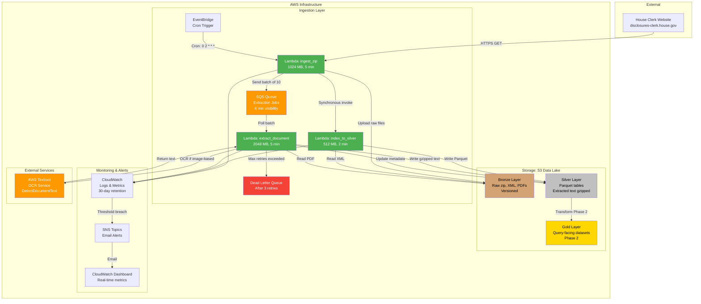
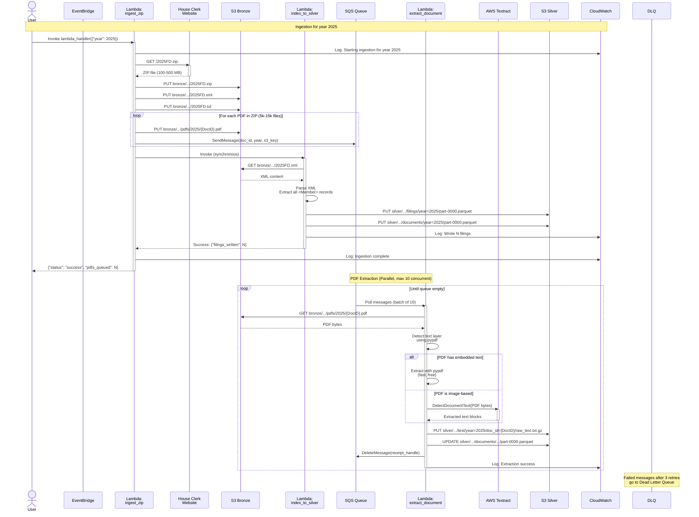
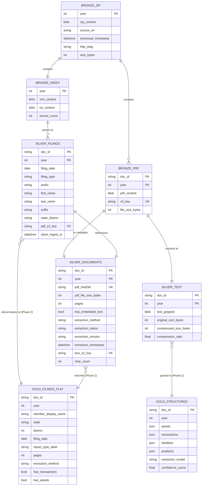
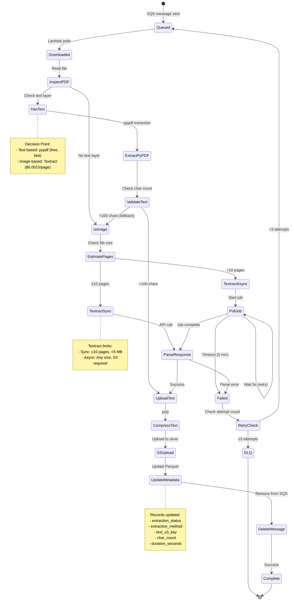
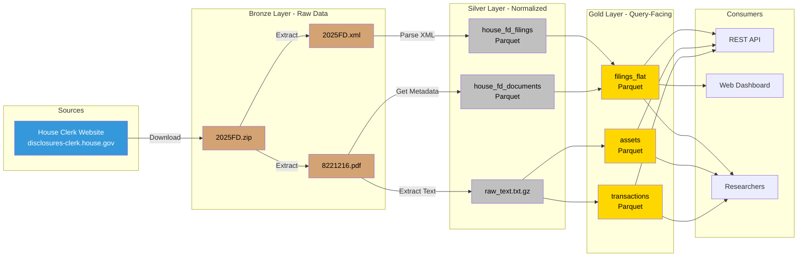
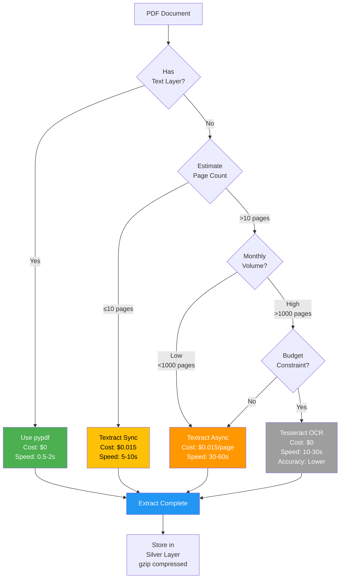
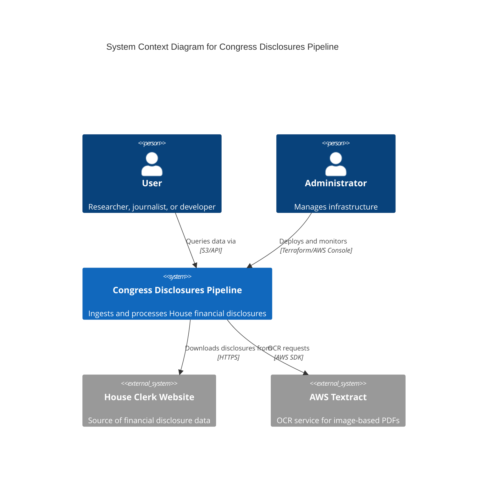
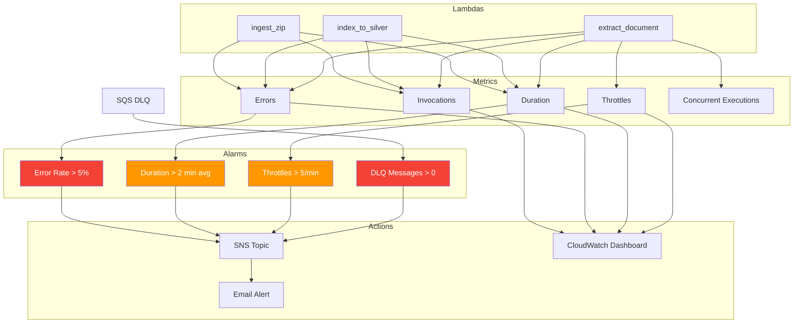

# System Diagrams

Comprehensive visual documentation of the Congress Financial Disclosures pipeline architecture, data flow, and relationships.

---

## System Architecture Overview

---

## Sequence Diagram: Complete Ingestion Flow

---

## Entity Relationship Diagram (ERD)

---

## State Machine: PDF Extraction Process

---

## Data Lineage Flowchart

---

## Cost Optimization Decision Tree

---

## Deployment Architecture

---

## Monitoring & Alerting Flow

---

For more details on each component, see:
- [ARCHITECTURE.md](ARCHITECTURE.md): Detailed technical architecture
- [DEPLOYMENT.md](DEPLOYMENT.md): Step-by-step deployment guide
- [API_STRATEGY.md](API_STRATEGY.md): Public API design and rate limiting
