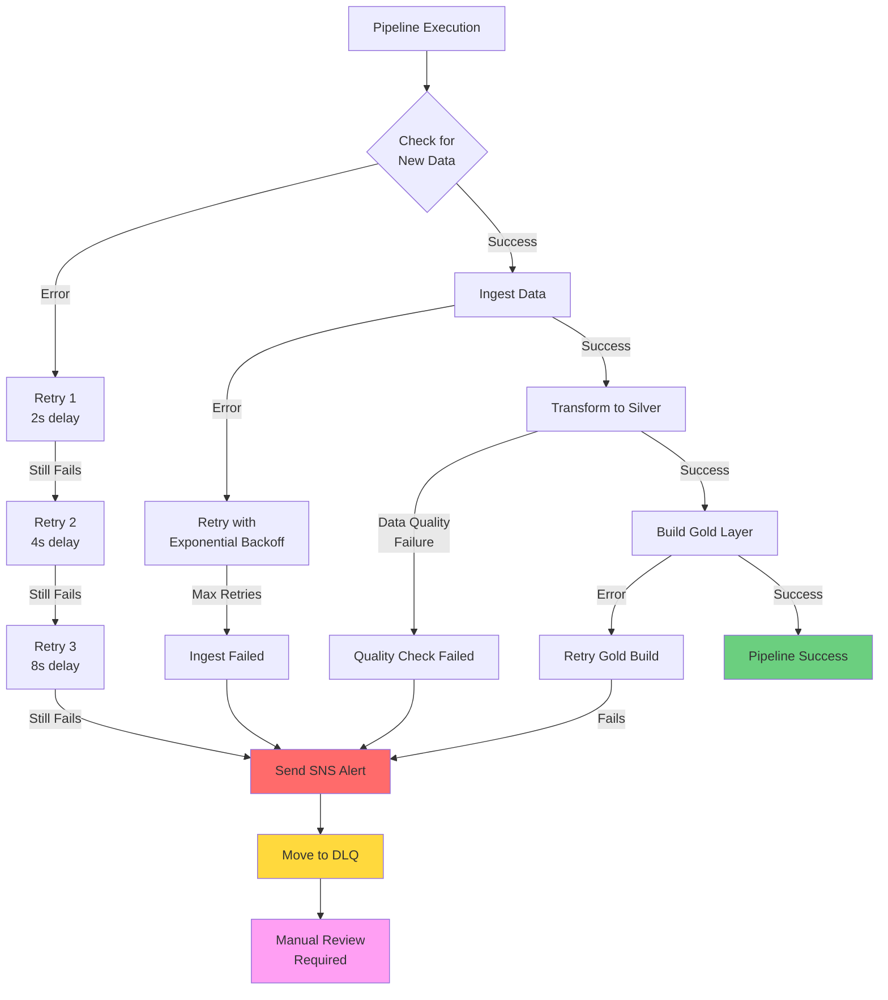

# Error Handling Strategy - Congress Disclosures Pipeline

## Overview
This document outlines the comprehensive error handling strategy across all pipeline layers (Bronze, Silver, Gold) with retry logic, dead letter queues, and SNS alerting.

## Error Handling Flow

## Retry Strategy by Layer

### Bronze Layer (Ingestion)
- **Max Retries**: 6
- **Backoff**: Exponential (2x)
- **Initial Interval**: 10 seconds
- **Timeout**: 600 seconds
- **Errors Handled**:
  - Network timeouts
  - Rate limiting (HTTP 429)
  - Temporary AWS service errors

### Silver Layer (Transformation)
- **Max Retries**: 3
- **Backoff**: Exponential (2x)
- **Initial Interval**: 5 seconds
- **Timeout**: 300 seconds
- **Errors Handled**:
  - Schema validation failures
  - Data parsing errors
  - S3 write failures

### Gold Layer (Analytics)
- **Max Retries**: 3
- **Backoff**: Linear
- **Initial Interval**: 10 seconds
- **Timeout**: 600 seconds
- **Errors Handled**:
  - DuckDB query failures
  - Dimension lookup failures
  - Aggregate computation errors

## Dead Letter Queues (DLQ)

All SQS queues have associated DLQs with:
- **Max Receive Count**: 3
- **Retention**: 14 days
- **Monitoring**: CloudWatch alarms on queue depth > 0

## SNS Alert Categories

1. **Critical** (Immediate Action):
   - Pipeline complete failure
   - Data quality check failures
   - DLQ messages > 10

2. **Warning** (Review Within 24h):
   - Partial failures (some years/quarters failed)
   - Retry count > 50% of max
   - Slow execution (> 2x expected time)

3. **Info** (Monitoring):
   - Successful completions
   - Watermark updates
   - Performance metrics

## Error Recovery Procedures

### Automatic Recovery
- Exponential backoff retries
- Circuit breaker pattern for external APIs
- Graceful degradation (skip failed items, continue pipeline)

### Manual Recovery
1. Review DLQ messages in AWS Console
2. Identify root cause from CloudWatch Logs
3. Fix data/code issue
4. Reprocess from DLQ or re-trigger pipeline
5. Update watermarks if needed

## Monitoring

- **CloudWatch Dashboards**: Real-time pipeline health
- **CloudWatch Alarms**: Automated alerts on failures
- **X-Ray Tracing**: Distributed tracing for debugging
- **SNS Topics**: Email/SMS notifications
