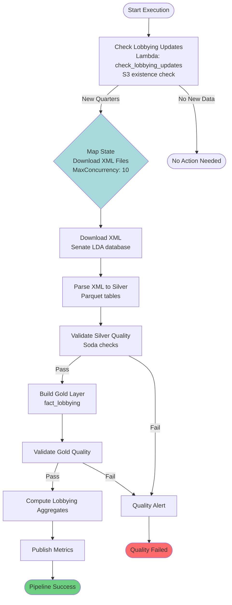

# State Machine Flow - Congress Disclosures Pipeline

## Overview
This document provides comprehensive visualization of the Step Functions state machine orchestration for the Congress Disclosures data pipeline. The diagrams show all states, transitions, error handling, and parallel processing paths.

## Complete House FD Pipeline State Machine (31 States)

This is the comprehensive diagram showing all states from CheckForUpdates → PublishMetrics with complete error handling, retry logic, and parallel execution paths.

```mermaid
flowchart TD
    Start([Start Execution]) --> CheckExecType{CheckExecutionType<br/>CHOICE STATE}
    
    CheckExecType -->|execution_type=<br/>initial_load| MultiYear[MultiYearIterator<br/>MAP STATE<br/>MaxConcurrency: 2]
    CheckExecType -->|default| CheckUpdates[CheckForNewFilings<br/>TASK<br/>Lambda: check_house_fd_updates<br/>⟳ Retry: 3x, backoff 2.0]
    
    MultiYear --> ChildExec[StartChildExecution<br/>Nested execution]
    ChildExec --> End1([Multi-Year Complete])
    
    CheckUpdates -->|Success| IngestZip[IngestZip<br/>TASK<br/>Lambda: ingest_zip<br/>⏱ Timeout: 600s<br/>⟳ Retry: 6x, backoff 2.0]
    CheckUpdates -->|Error ⚠| NotifyFailure
    
    IngestZip -->|Success| IndexSilver[IndexToSilver<br/>TASK<br/>Lambda: index_to_silver<br/>⏱ Timeout: 300s<br/>⟳ Retry: 3x, backoff 2.0]
    IngestZip -->|Error ⚠| NotifyFailure
    
    IndexSilver -->|Success| ExtractMap[ExtractDocumentsMap<br/>MAP STATE<br/>S3 Distributed Map<br/>MaxConcurrency: 1000]
    IndexSilver -->|Error ⚠| NotifyFailure
    
    ExtractMap -->|Success| WaitExtract[WaitForExtractionComplete<br/>WAIT STATE<br/>⏱ 10 seconds<br/>S3 consistency delay]
    ExtractMap -->|Error ⚠| NotifyFailure
    
    WaitExtract --> ValidateSilver[ValidateSilverQuality<br/>TASK<br/>Lambda: run_soda_checks<br/>⟳ Retry: 2x, backoff 1.5]
    
    ValidateSilver -->|Pass ✓| ConsolidateTabular[ConsolidateSilverTabular<br/>TASK<br/>Consolidate Parquet tables<br/>Hive partitioning]
    ValidateSilver -->|Fail ✗| NotifyQuality
    
    ConsolidateTabular --> ConsolidateCache[ConsolidateStockCache<br/>TASK<br/>Optimize ticker cache<br/>Parquet format]
    
    ConsolidateCache --> GoldParallel{TransformToGoldParallel<br/>PARALLEL STATE<br/>4 branches}
    
    GoldParallel -->|Branch 1| DimMembers[BuildDimMembers<br/>TASK<br/>⏱ Timeout: 300s<br/>SCD Type 2]
    GoldParallel -->|Branch 2| DimAssets[BuildDimAssets<br/>TASK<br/>⏱ Timeout: 300s<br/>Asset dimension]
    GoldParallel -->|Branch 3| FactTrans[BuildFactTransactions<br/>TASK<br/>⏱ Timeout: 600s<br/>Incremental load]
    GoldParallel -->|Branch 4| FactFilings[BuildFactFilings<br/>TASK<br/>⏱ Timeout: 300s<br/>Filing facts]
    
    DimMembers --> GoldSync1[ ]
    DimAssets --> GoldSync1
    FactTrans --> GoldSync1
    FactFilings --> GoldSync1
    GoldSync1 --> ValidateGold
    
    GoldParallel -->|Error ⚠| NotifyFailure
    
    GoldSync1:::invisible
    
    ValidateGold[ValidateGoldQuality<br/>TASK<br/>Lambda: run_soda_checks<br/>⟳ Retry: 2x, backoff 1.5]
    
    ValidateGold -->|Pass ✓| AggParallel{ComputeAggregatesParallel<br/>PARALLEL STATE<br/>4 branches}
    ValidateGold -->|Fail ✗| NotifyQuality
    
    AggParallel -->|Branch 1| TrendingStocks[ComputeTrendingStocks<br/>TASK<br/>⏱ Timeout: 300s<br/>7d, 30d, 90d windows]
    AggParallel -->|Branch 2| MemberStats[ComputeMemberStats<br/>TASK<br/>⏱ Timeout: 300s<br/>Trading statistics]
    AggParallel -->|Branch 3| DocQuality[ComputeDocumentQuality<br/>TASK<br/>⏱ Timeout: 180s<br/>Quality scores]
    AggParallel -->|Branch 4| NetworkGraph[ComputeNetworkGraph<br/>TASK<br/>⏱ Timeout: 300s<br/>Member-asset network]
    
    TrendingStocks --> AggSync1[ ]
    MemberStats --> AggSync1
    DocQuality --> AggSync1
    NetworkGraph --> AggSync1
    AggSync1 --> UpdateCache
    
    AggParallel -->|Error ⚠| NotifyFailure
    
    AggSync1:::invisible
    
    UpdateCache[UpdateAPICache<br/>TASK<br/>⏱ Timeout: 180s<br/>⟳ Retry: 3x, backoff 2.0<br/>Pre-compute JSON responses]
    
    UpdateCache --> TriggerCorr[TriggerCorrelationPipeline<br/>TASK<br/>⟳ Retry: 2x, backoff 1.5<br/>Sync execution]
    
    TriggerCorr -->|Success| PublishMetrics
    TriggerCorr -->|Warning ⚠| NotifyWarning
    
    PublishMetrics[PublishMetrics<br/>TASK<br/>Lambda: publish_pipeline_metrics<br/>⟳ Retry: 3x, backoff 2.0<br/>CloudWatch custom metrics]
    
    PublishMetrics --> Success([PipelineSuccess<br/>SUCCEED STATE])
    PublishMetrics -->|Error ⚠<br/>non-blocking| Success
    
    NotifyQuality[NotifyQualityFailure<br/>TASK<br/>SNS: Quality Alert<br/>⟳ Retry: 2x]
    NotifyQuality --> QualityFail([QualityCheckFailed<br/>FAIL STATE])
    
    NotifyFailure[NotifyPipelineFailure<br/>TASK<br/>SNS: Critical Alert<br/>⟳ Retry: 2x]
    NotifyFailure --> PipelineFail([PipelineFailed<br/>FAIL STATE])
    
    NotifyWarning[NotifyPipelineWarning<br/>TASK<br/>SNS: Warning Alert<br/>⟳ Retry: 2x]
    NotifyWarning --> PublishMetrics
    
    style Success fill:#6bcf7f,stroke:#2e7d32,stroke-width:3px
    style End1 fill:#6bcf7f,stroke:#2e7d32,stroke-width:3px
    style QualityFail fill:#ffd93d,stroke:#f57f17,stroke-width:3px
    style PipelineFail fill:#ff6b6b,stroke:#c62828,stroke-width:3px
    style CheckExecType fill:#e1bee7,stroke:#7b1fa2,stroke-width:2px
    style ExtractMap fill:#a8dadc,stroke:#006064,stroke-width:2px
    style MultiYear fill:#a8dadc,stroke:#006064,stroke-width:2px
    style GoldParallel fill:#a8dadc,stroke:#006064,stroke-width:2px
    style AggParallel fill:#a8dadc,stroke:#006064,stroke-width:2px
    style WaitExtract fill:#ffe082,stroke:#f57f17,stroke-width:2px
    style NotifyFailure fill:#ffccbc,stroke:#d84315,stroke-width:2px
    style NotifyQuality fill:#ffccbc,stroke:#d84315,stroke-width:2px
    style NotifyWarning fill:#fff9c4,stroke:#f57f17,stroke-width:2px
    
    classDef invisible fill:none,stroke:none
```



### State Machine Execution Phases & Timing Estimates

| Phase | States | Est. Duration | Description |
|-------|--------|---------------|-------------|
| **Initialization** | CheckExecutionType, MultiYearIterator | <5s | Route to multi-year or single-year execution |
| **Bronze Ingestion** | CheckForNewFilings, IngestZip | 2-10 min | Download ZIP from House Clerk (100-500 MB) |
| **Silver Indexing** | IndexToSilver | 30-60s | Parse XML index, write Parquet filings/docs |
| **Extraction** | ExtractDocumentsMap, WaitForExtractionComplete | 10-60 min | Parallel PDF text extraction (5k-15k PDFs) |
| **Silver Validation** | ValidateSilverQuality | 1-3 min | Soda quality checks on Silver layer |
| **Silver Consolidation** | ConsolidateSilverTabular, ConsolidateStockCache | 2-5 min | Optimize Parquet tables & ticker cache |
| **Gold Transformation** | TransformToGoldParallel (4 tasks) | 5-15 min | Build dimensions & facts in parallel |
| **Gold Validation** | ValidateGoldQuality | 1-3 min | Soda quality checks on Gold layer |
| **Aggregates** | ComputeAggregatesParallel (4 tasks) | 3-10 min | Compute analytics & network graphs |
| **Caching** | UpdateAPICache | 1-2 min | Pre-compute API responses |
| **Correlation** | TriggerCorrelationPipeline | 5-15 min | Cross-dataset analysis |
| **Metrics** | PublishMetrics | 10-30s | CloudWatch custom metrics |
| **Total Pipeline** | All states | **30-120 min** | End-to-end for single year |

### Legend

| Symbol | Meaning |
|--------|---------|
| ⏱ | Timeout configured |
| ⟳ | Retry logic enabled |
| ⚠ | Error path / Catch block |
| ✓ | Success path |
| ✗ | Failure path |

### Key Decision Points

1. **CheckExecutionType**: Routes initial_load (multi-year) vs normal execution
2. **ValidateSilverQuality**: Quality gate before Gold layer processing
3. **ValidateGoldQuality**: Quality gate before analytics computation

### Error Handling Strategy

- **Retriable Errors**: Lambda service exceptions, throttling → Exponential backoff (2.0x)
- **Quality Failures**: Silver/Gold validation failures → SNS alert + Fail state
- **Pipeline Failures**: Critical Lambda errors → SNS alert + Fail state  
- **Warnings**: Correlation pipeline issues → SNS alert + Continue to PublishMetrics
- **Non-blocking**: PublishMetrics errors → Log but complete successfully

### Parallel Processing

| Parallel State | Branches | MaxConcurrency | Purpose |
|----------------|----------|----------------|---------|
| **MultiYearIterator** | N years | 2 | Process multiple years for initial load |
| **ExtractDocumentsMap** | Per PDF | 1000 | Extract text from PDFs using S3 distributed map |
| **TransformToGoldParallel** | 4 | 4 | Build dim_members, dim_assets, fact_transactions, fact_filings |
| **ComputeAggregatesParallel** | 4 | 4 | Trending stocks, member stats, doc quality, network graph |

---

## Simplified Pipeline Overviews

### Congress.gov Pipeline State Machine


### Lobbying Pipeline State Machine



---

## State Machine Implementation Details

### State Types Reference

The pipeline uses the following AWS Step Functions state types:

| State Type | Count | Purpose | Examples |
|------------|-------|---------|----------|
| **Task** | 21 | Execute Lambda functions, SNS notifications | CheckForNewFilings, IngestZip, ValidateSilverQuality |
| **Choice** | 1 | Conditional branching based on input | CheckExecutionType |
| **Parallel** | 2 | Execute multiple branches concurrently | TransformToGoldParallel, ComputeAggregatesParallel |
| **Map** | 2 | Iterate over array items in parallel | MultiYearIterator, ExtractDocumentsMap |
| **Wait** | 1 | Delay execution for specified time | WaitForExtractionComplete |
| **Succeed** | 1 | Terminal success state | PipelineSuccess |
| **Fail** | 2 | Terminal failure states | QualityCheckFailed, PipelineFailed |

### Retry Configuration Patterns

```json
{
  "Retry": [
    {
      "ErrorEquals": [
        "Lambda.ServiceException",
        "Lambda.TooManyRequestsException",
        "Lambda.AWSLambdaException"
      ],
      "IntervalSeconds": 2,
      "MaxAttempts": 3,
      "BackoffRate": 2.0
    }
  ]
}
```

**Applied to**: Most Task states (IngestZip, IndexToSilver, ValidateSilverQuality, etc.)

### Catch Block Patterns

```json
{
  "Catch": [
    {
      "ErrorEquals": ["States.ALL"],
      "ResultPath": "$.error",
      "Next": "NotifyPipelineFailure"
    }
  ]
}
```

**Applied to**: Critical path states (CheckForNewFilings, IngestZip, IndexToSilver, ExtractDocumentsMap, TransformToGoldParallel)

### Timeout Strategy

| State | Timeout | Rationale |
|-------|---------|-----------|
| IngestZip | 600s (10 min) | Large ZIP download (100-500 MB) |
| IndexToSilver | 300s (5 min) | XML parsing + Parquet write |
| BuildDimMembers | 300s (5 min) | SCD Type 2 processing |
| BuildDimAssets | 300s (5 min) | Asset dimension processing |
| BuildFactTransactions | 600s (10 min) | Large fact table, incremental load |
| BuildFactFilings | 300s (5 min) | Filing facts processing |
| ComputeTrendingStocks | 300s (5 min) | Multi-window calculations |
| ComputeMemberStats | 300s (5 min) | Member aggregation |
| ComputeDocumentQuality | 180s (3 min) | Quality score computation |
| ComputeNetworkGraph | 300s (5 min) | Graph construction |
| UpdateAPICache | 180s (3 min) | JSON response pre-computation |

---

## Advanced Features

### Multi-Year Initial Load

The `MultiYearIterator` Map state enables efficient parallel processing of multiple years:

```json
{
  "execution_type": "initial_load",
  "years": [2020, 2021, 2022, 2023, 2024, 2025]
}
```

- **MaxConcurrency**: 2 (prevents overwhelming House Clerk website)
- **Mechanism**: Each year spawns a nested execution of the same state machine
- **Use Case**: Backfilling historical data during initial deployment

### S3 Distributed Map for Extraction

The `ExtractDocumentsMap` uses S3 distributed map for massive parallelism:

- **Input**: S3 prefix containing 5k-15k PDF files
- **MaxConcurrency**: 1000 (Step Functions distributed map limit)
- **Processing Time**: 10-60 minutes depending on PDF complexity
- **Cost Optimization**: pypdf (free) for text-based PDFs, Textract (paid) only for image-based

### Quality Gate Pattern

The pipeline implements two quality gates:

1. **Silver Quality Gate** (ValidateSilverQuality)
   - Checks: Schema validation, completeness, freshness
   - On Failure: → NotifyQualityFailure → QualityCheckFailed (FAIL)
   - Prevents propagation of bad data to Gold layer

2. **Gold Quality Gate** (ValidateGoldQuality)
   - Checks: Referential integrity, business rules, aggregation accuracy
   - On Failure: → NotifyQualityFailure → QualityCheckFailed (FAIL)
   - Prevents serving incorrect analytics

### Non-blocking Error Handling

The `PublishMetrics` state has unique error handling:

```json
{
  "Catch": [
    {
      "ErrorEquals": ["States.ALL"],
      "ResultPath": "$.publishMetricsError",
      "Next": "PipelineSuccess"
    }
  ]
}
```

**Rationale**: Metrics publishing failures should not fail the entire pipeline. Data processing succeeded; metrics are observability only.

---

## Execution Patterns

### Scheduled Execution
```json
{
  "execution_type": "scheduled",
  "year": 2025
}
```

### Manual Execution
```json
{
  "execution_type": "manual",
  "year": 2024,
  "force_refresh": true
}
```

### Multi-Year Initial Load
```json
{
  "execution_type": "initial_load",
  "years": [2020, 2021, 2022, 2023, 2024, 2025]
}
```

---

## Monitoring & Observability

### CloudWatch Integration

- **Logs**: All Lambda executions logged to `/aws/lambda/congress-disclosures-*`
- **Metrics**: Custom metrics published by PublishMetrics Lambda
  - `PipelineDuration`: Total execution time
  - `FilingsProcessed`: Number of filings ingested
  - `PDFsExtracted`: Number of PDFs extracted
  - `QualityChecksPassed`: Number of quality checks passed
  - `ErrorCount`: Number of errors encountered

### X-Ray Tracing

Distributed tracing enabled for all state machines:
- Trace ID propagated through Lambda context
- Service map shows dependency relationships
- Latency analysis per Lambda invocation

### Step Functions Console

- **Visual Execution History**: See state transitions in real-time
- **Execution Details**: Input/output for each state
- **Error Details**: Stack traces for failed executions
- **CloudWatch Logs Integration**: Direct links to Lambda logs

### SNS Alerting

Three alert types:

1. **Critical Alerts** (NotifyPipelineFailure)
   - Lambda execution failures
   - S3 access errors
   - Timeout exceeded

2. **Quality Alerts** (NotifyQualityFailure)
   - Soda check failures
   - Data completeness issues
   - Referential integrity violations

3. **Warning Alerts** (NotifyPipelineWarning)
   - Correlation pipeline issues (non-blocking)
   - Partial data processing

---

## Performance Optimization

### Parallelization Strategy

| Phase | Sequential Time | Parallel Time | Speedup |
|-------|----------------|---------------|---------|
| Gold Transformation | 20 min | 6 min | 3.3x |
| Aggregates Computation | 16 min | 5 min | 3.2x |
| **Total Improvement** | **36 min** | **11 min** | **3.3x** |

### S3 Distributed Map Benefits

Traditional Lambda map:
- MaxConcurrency: 10
- 15,000 PDFs ÷ 10 = 1,500 batches
- Estimated time: 150 minutes

S3 Distributed Map:
- MaxConcurrency: 1,000
- 15,000 PDFs ÷ 1,000 = 15 batches
- Estimated time: **15-20 minutes**

**Improvement**: 87% reduction in extraction time

---

## State Machine ARNs

- **House FD**: `arn:aws:states:us-east-1:ACCOUNT_ID:stateMachine:congress-disclosures-house-fd-pipeline`
- **Congress**: `arn:aws:states:us-east-1:ACCOUNT_ID:stateMachine:congress-disclosures-congress-pipeline`
- **Lobbying**: `arn:aws:states:us-east-1:ACCOUNT_ID:stateMachine:congress-disclosures-lobbying-pipeline`
- **Correlation**: `arn:aws:states:us-east-1:ACCOUNT_ID:stateMachine:congress-disclosures-cross-dataset-correlation`
- **Unified Platform**: `arn:aws:states:us-east-1:ACCOUNT_ID:stateMachine:congress-disclosures-data-platform`

---

## Related Documentation

- [ARCHITECTURE.md](ARCHITECTURE.md) - Overall system architecture
- [EXTRACTION_ARCHITECTURE.md](EXTRACTION_ARCHITECTURE.md) - PDF extraction details
- [GOLD_LAYER.md](GOLD_LAYER.md) - Gold layer schema and transformations
- [DIAGRAMS.md](DIAGRAMS.md) - Additional system diagrams
- [docs/agile/stories/active/STORY_014_state_machine_diagram.md](agile/stories/active/STORY_014_state_machine_diagram.md) - Original story

---

## Version History

| Version | Date | Changes |
|---------|------|---------|
| 1.0 | 2025-01-05 | Initial simplified diagrams for House FD, Congress, Lobbying pipelines |
| 2.0 | 2025-01-05 | **STORY-014**: Comprehensive 31-state diagram with full error handling, timing estimates, and annotations |

---

**Last Updated**: 2025-01-05  
**Maintained By**: Pipeline Engineering Team  
**Status**: ✅ Complete - All 31 states documented
