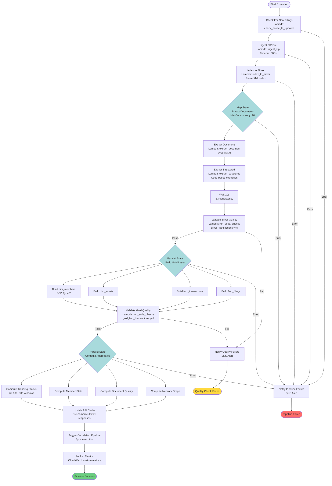
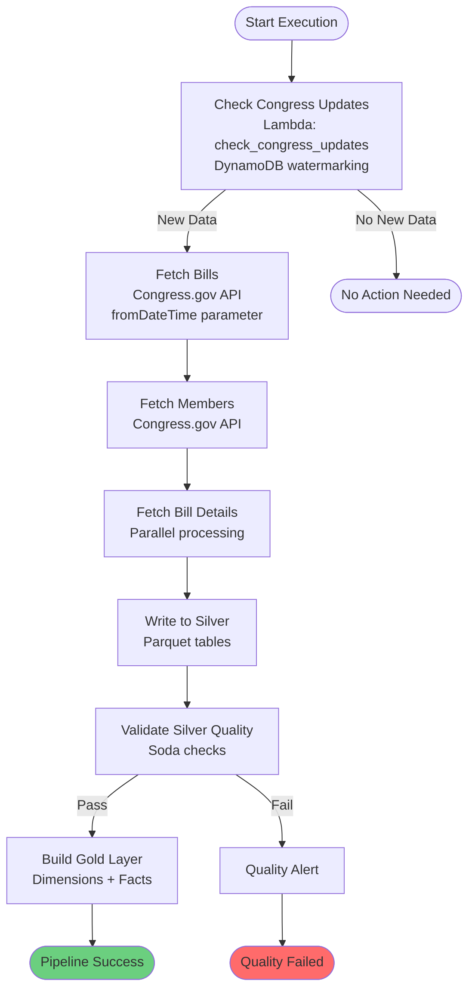

# State Machine Flow - Congress Disclosures Pipeline

## Overview
This document visualizes the Step Functions state machine orchestration for the House Financial Disclosures pipeline.

## House FD Pipeline State Machine



## Congress.gov Pipeline State Machine



## Lobbying Pipeline State Machine


## Key Features

### Parallel Processing
- **Map States**: Process multiple documents/files concurrently
- **Parallel States**: Build multiple Gold tables simultaneously
- **MaxConcurrency**: 10 (prevents Lambda throttling)

### Error Handling
- **Retry Logic**: Exponential backoff on transient errors
- **Catch Blocks**: Graceful failure handling
- **SNS Alerts**: Immediate notification on failures

### Quality Gates
- **Silver Validation**: Schema, completeness, freshness checks
- **Gold Validation**: Referential integrity, business rules
- **Soda Integration**: YAML-defined quality checks

### Watermarking
- **House FD**: SHA256 hash comparison
- **Congress**: DynamoDB timestamp tracking
- **Lobbying**: S3 object existence checking

## Execution Patterns

### Scheduled Execution
```json
{
  "execution_type": "scheduled",
  "year": 2025
}
```

### Manual Execution
```json
{
  "execution_type": "manual",
  "year": 2024,
  "force_refresh": true
}
```

### Multi-Year Initial Load
```json
{
  "execution_type": "initial_load",
  "parameters": {
    "years": [2020, 2021, 2022, 2023, 2024, 2025]
  }
}
```

## Monitoring

- **CloudWatch Logs**: All Lambda executions logged
- **X-Ray Tracing**: Distributed tracing enabled
- **Step Functions Console**: Visual execution history
- **Custom Metrics**: Pipeline duration, success rate, data volume

## State Machine ARNs

- **House FD**: `arn:aws:states:us-east-1:ACCOUNT_ID:stateMachine:congress-disclosures-house-fd-pipeline`
- **Congress**: `arn:aws:states:us-east-1:ACCOUNT_ID:stateMachine:congress-disclosures-congress-pipeline`
- **Lobbying**: `arn:aws:states:us-east-1:ACCOUNT_ID:stateMachine:congress-disclosures-lobbying-pipeline`
- **Correlation**: `arn:aws:states:us-east-1:ACCOUNT_ID:stateMachine:congress-disclosures-cross-dataset-correlation`
