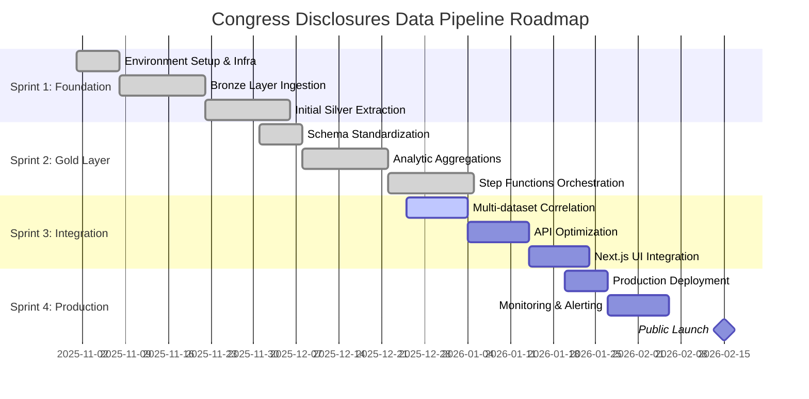

# 🗺️ Project Roadmap - Agile Sprints

## 🎯 Current Status: Sprint 3 (Integration)

We are currently focusing on:
- **STORY-028**: Unified State Machine Design.
- **STORY-042**: API Performance & Data Quality.
- **STORY-050**: UI/UX Refinement & Next.js Prerendering.

For more details, see:
- [Sprint 3 Plan](docs/agile/sprints/SPRINT_3_PLAN.md)
- [Project Metrics](docs/agile/metrics/INDEX.md)
