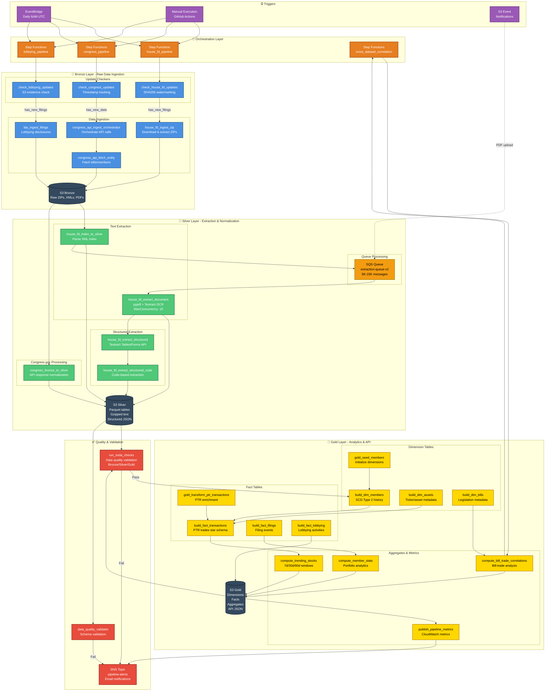

# Pipeline Architecture Diagram

## Overview

This diagram shows the complete serverless data pipeline architecture for U.S. Congress financial disclosures, implementing a Bronze → Silver → Gold medallion architecture using AWS services.

## Full Pipeline Architecture

## Legend

### Layer Color Coding

| Color | Layer | Description |
|-------|-------|-------------|
| 🔵 **Blue** | Bronze | Raw data ingestion, immutable source data |
| 🟢 **Green** | Silver | Extracted, normalized, queryable data |
| 🟡 **Yellow** | Gold | Aggregated, enriched, API-ready data |
| 🟣 **Purple** | Triggers | Event sources and schedulers |
| 🟠 **Orange** | Orchestration | Step Functions state machines |
| 🔴 **Red** | Quality | Validation and monitoring |
| ⚫ **Gray** | Storage | S3 buckets |
| 🟤 **Brown** | Queue | SQS message queues |

### AWS Services Used

- **EventBridge**: Scheduled triggers (daily 6AM UTC)
- **Step Functions**: Workflow orchestration (4 state machines)
- **Lambda**: Serverless compute (27 functions)
- **S3**: Data lake storage (Bronze/Silver/Gold)
- **SQS**: Message queuing for parallel processing
- **SNS**: Email alerts for pipeline failures
- **DynamoDB**: Watermark tracking (not shown in diagram)
- **Textract**: OCR and table extraction (invoked by Lambdas)
- **CloudWatch**: Metrics and logging (not shown in diagram)

## Lambda Functions by Phase (27 Total)

### Bronze Layer - Ingestion (7 functions)
1. `check_house_fd_updates` - SHA256-based watermarking for House FD
2. `check_congress_updates` - Timestamp-based watermarking for Congress.gov
3. `check_lobbying_updates` - S3 existence check for lobbying data
4. `house_fd_ingest_zip` - Download and extract House FD ZIP files
5. `congress_api_ingest_orchestrator` - Orchestrate Congress.gov API calls
6. `congress_api_fetch_entity` - Fetch specific bills/members
7. `lda_ingest_filings` - Ingest lobbying disclosure filings

### Silver Layer - Extraction (5 functions)
8. `house_fd_index_to_silver` - Parse XML index to Parquet
9. `house_fd_extract_document` - Text extraction with pypdf/Textract
10. `house_fd_extract_structured` - Textract Tables/Forms API extraction
11. `house_fd_extract_structured_code` - Code-based structured extraction
12. `congress_bronze_to_silver` - Normalize Congress.gov API responses

### Quality & Validation (2 functions)
13. `run_soda_checks` - Data quality validation across all layers
14. `data_quality_validator` - Schema validation

### Gold Layer - Dimensions (4 functions)
15. `build_dim_members` - Member dimension (SCD Type 2)
16. `build_dim_assets` - Asset/ticker dimension
17. `build_dim_bills` - Bill/legislation dimension
18. `gold_seed_members` - Initialize member dimensions

### Gold Layer - Facts (4 functions)
19. `build_fact_transactions` - Transaction fact table (star schema)
20. `build_fact_filings` - Filing events fact table
21. `build_fact_lobbying` - Lobbying activities fact table
22. `gold_transform_ptr_transactions` - PTR transaction enrichment

### Gold Layer - Aggregates (4 functions)
23. `compute_trending_stocks` - Trending stock analysis (7d/30d/90d)
24. `compute_member_stats` - Member portfolio analytics
25. `compute_bill_trade_correlations` - Bill-trade correlation analysis
26. `publish_pipeline_metrics` - CloudWatch custom metrics

### Utility (1 function)
27. `stub_handler` - Testing/development stub

## Data Flow Summary

### 1. Triggers
- **EventBridge**: Daily scheduled execution (6AM UTC)
- **Manual**: GitHub Actions workflow dispatch
- **S3 Events**: Automatic triggers on new PDF uploads

### 2. Bronze Layer (Ingestion)
- Check for new data using watermarking strategies
- Download raw files (ZIPs, PDFs) from source systems
- Store immutably in S3 with metadata tags
- Parse XML indices

### 3. Silver Layer (Extraction)
- Extract text from PDFs (pypdf → Textract fallback)
- Queue extraction jobs via SQS for parallel processing
- Extract structured data using Textract Tables/Forms API
- Normalize data into Parquet tables
- Store gzipped text and structured JSON

### 4. Quality Gates
- Run Soda quality checks on Silver tables
- Validate schemas and data integrity
- Send SNS alerts on failures
- Block Gold processing if quality fails

### 5. Gold Layer (Analytics)
- Build dimension tables (members, assets, bills)
- Build fact tables (transactions, filings, lobbying)
- Compute aggregates (trending stocks, member stats)
- Generate API-ready JSON files
- Publish CloudWatch metrics

### 6. Cross-Dataset Correlation
- Analyze bill-trade correlations
- Compute network graphs
- Update Gold aggregates

## Key Features

### Parallel Processing
- **SQS-based**: 5K-15K PDF extraction jobs processed concurrently
- **Step Functions Map**: MaxConcurrency: 10 for document extraction
- **Parallel Gold**: Dimensions and facts built simultaneously

### Error Handling
- **Exponential Backoff**: Automatic retries with increasing delays
- **Dead Letter Queue**: Failed messages captured for investigation
- **SNS Alerts**: Email notifications on pipeline failures
- **Quality Gates**: Prevent bad data from reaching Gold layer

### Watermarking Strategies
- **House FD**: SHA256 hash comparison of ZIP files
- **Congress.gov**: Timestamp-based incremental sync
- **Lobbying**: S3 existence check for year/quarter

### Cost Optimization
- **Serverless**: Pay only for compute used
- **Parallel Limits**: MaxConcurrency prevents runaway costs
- **S3 Intelligent Tiering**: Automatic cost optimization
- **Parquet Compression**: Snappy compression reduces storage costs

## Architecture Patterns

### Medallion Architecture
- **Bronze**: Immutable, raw, byte-for-byte source data
- **Silver**: Cleaned, normalized, queryable Parquet tables
- **Gold**: Aggregated, enriched, API-ready star schema

### Event-Driven Processing
- **S3 Events**: Trigger extraction on new PDF uploads
- **SQS Queues**: Decouple producers from consumers
- **Step Functions**: Orchestrate complex workflows

### Quality-First Design
- **Soda Checks**: SQL-based quality rules at every layer
- **Schema Validation**: Prevent schema drift
- **SNS Alerts**: Immediate notification of issues
- **Watermarking**: Prevent duplicate processing

## State Machines

### house_fd_pipeline
- Bronze: Ingest → Index → Queue
- Silver: Extract (parallel) → Structure
- Gold: Build dimensions → Build facts → Compute aggregates
- Quality: Validate at each layer

### congress_pipeline
- Bronze: Check updates → Fetch bills → Fetch members
- Silver: Normalize API responses
- Gold: Build dimensions → Build facts

### lobbying_pipeline
- Bronze: Check updates → Ingest filings
- Silver: Extract structured data
- Gold: Build fact tables

### cross_dataset_correlation
- Gold: Analyze bill-trade correlations
- Gold: Update aggregate tables

## Related Documentation

- **Architecture**: [ARCHITECTURE.md](../../ARCHITECTURE.md)
- **State Machine Flow**: [STATE_MACHINE_FLOW.md](../../STATE_MACHINE_FLOW.md)
- **Extraction Details**: [EXTRACTION_ARCHITECTURE.md](../../EXTRACTION_ARCHITECTURE.md)
- **Gold Layer**: [GOLD_LAYER.md](../../GOLD_LAYER.md)
- **Data Contracts**: [technical/DATA_CONTRACTS.md](../technical/DATA_CONTRACTS.md)
- **Story File**: [stories/active/STORY_010_pipeline_architecture_diagram.md](../stories/active/STORY_010_pipeline_architecture_diagram.md)

---

**Created**: 2026-01-05  
**Story**: STORY-010  
**Sprint**: Sprint 1  
**Epic**: EPIC-001
