# Pipeline Architecture Diagram

**Story**: STORY-010 | **Epic**: EPIC-001 | **Sprint**: Sprint 1

## Overview

This document provides a comprehensive visual representation of the Congress Disclosures Pipeline architecture, showing all AWS services, data flow, and Lambda functions organized by processing phase.

## System Architecture

```mermaid
graph TB
    subgraph Triggers["🔔 Triggers"]
        EB_HFD["EventBridge<br/>house_fd_daily<br/>cron(0 9 * * ? *)<br/>DISABLED"]
        EB_CG["EventBridge<br/>congress_daily<br/>cron(0 8 * * ? *)<br/>DISABLED"]
        EB_LB["EventBridge<br/>lobbying_weekly<br/>cron(0 11 ? * MON *)<br/>DISABLED"]
        Manual["Manual Execution<br/>GitHub Actions / Console"]
    end

    subgraph Orchestration["🎭 Orchestration Layer"]
        SF_HFD["Step Functions<br/>house_fd_pipeline"]
        SF_CG["Step Functions<br/>congress_pipeline"]
        SF_LB["Step Functions<br/>lobbying_pipeline"]
        SF_CORR["Step Functions<br/>cross_dataset_correlation"]
    end

    subgraph CheckLayer["🔍 Watermarking & Update Checks"]
        L_CHK_HFD["Lambda<br/>check_house_fd_updates<br/>SHA256 watermarking"]
        L_CHK_CG["Lambda<br/>check_congress_updates<br/>Timestamp watermarking"]
        L_CHK_LB["Lambda<br/>check_lobbying_updates<br/>S3 existence check"]
    end

    subgraph Bronze["🥉 Bronze Layer - Raw Data Ingestion"]
        L_ING_HFD["Lambda<br/>house_fd_ingest_zip<br/>Timeout: 600s"]
        L_ING_CG_ORCH["Lambda<br/>congress_api_ingest_orchestrator"]
        L_ING_CG_FETCH["Lambda<br/>congress_api_fetch_entity"]
        L_ING_LB["Lambda<br/>lda_ingest_filings"]
        S3_BRONZE[("S3 Bronze<br/>bronze/house/financial/<br/>bronze/congress/<br/>bronze/lobbying/")]
    end

    subgraph Silver["🥈 Silver Layer - Extraction & Normalization"]
        L_IDX_SILVER["Lambda<br/>house_fd_index_to_silver<br/>Parse XML index"]
        L_EXTRACT_DOC["Lambda<br/>house_fd_extract_document<br/>pypdf + OCR fallback"]
        L_EXTRACT_STRUCT["Lambda<br/>house_fd_extract_structured<br/>AWS Textract"]
        L_EXTRACT_CODE["Lambda<br/>house_fd_extract_structured_code<br/>Code-based extraction"]
        L_REPROCESS["Lambda<br/>reprocess_filings<br/>Version management"]
        L_CG_BRONZE_SILVER["Lambda<br/>congress_bronze_to_silver<br/>Parquet normalization"]
        SQS_EXTRACT["SQS Queue<br/>extraction-queue<br/>Visibility: 300s<br/>Retention: 4 days"]
        SQS_DLQ["SQS DLQ<br/>extraction-dlq<br/>Retention: 14 days"]
        S3_SILVER[("S3 Silver<br/>silver/house/financial/text/<br/>silver/house/financial/structured/<br/>silver/congress/")]
    end

    subgraph Gold["🥇 Gold Layer - Dimensions, Facts & Aggregates"]
        subgraph Dimensions["Dimensions"]
            L_DIM_MEMBERS["Lambda<br/>build_dim_members<br/>SCD Type 2"]
            L_DIM_ASSETS["Lambda<br/>build_dim_assets"]
            L_DIM_BILLS["Lambda<br/>build_dim_bills"]
            L_GOLD_SEED["Lambda<br/>gold_seed_members"]
        end
        
        subgraph Facts["Facts"]
            L_FACT_FILINGS["Lambda<br/>build_fact_filings"]
            L_FACT_TRANS["Lambda<br/>build_fact_transactions"]
            L_FACT_LOBBY["Lambda<br/>build_fact_lobbying"]
            L_GOLD_PTR["Lambda<br/>gold_transform_ptr_transactions"]
        end
        
        subgraph Aggregates["Aggregates"]
            L_AGG_TRENDING["Lambda<br/>compute_trending_stocks<br/>7d, 30d, 90d windows"]
            L_AGG_STATS["Lambda<br/>compute_member_stats"]
            L_AGG_CORR["Lambda<br/>compute_bill_trade_correlations"]
        end
        
        S3_GOLD[("S3 Gold<br/>gold/dimensions/<br/>gold/facts/<br/>gold/aggregates/")]
    end

    subgraph Quality["✅ Data Quality & Monitoring"]
        L_SODA["Lambda<br/>run_soda_checks<br/>Silver & Gold validation"]
        L_QUALITY["Lambda<br/>data_quality_validator"]
        L_METRICS["Lambda<br/>publish_pipeline_metrics"]
        SNS["SNS Topics<br/>budget_alerts<br/>pipeline_alerts<br/>quality_alerts"]
        CW["CloudWatch<br/>Metrics & Alarms"]
    end

    subgraph API["🌐 API & Website"]
        API_GW["API Gateway<br/>(Optional)"]
        S3_WEB[("S3 Website<br/>Static JSON API<br/>/api/v1/")]
    end

    %% Trigger to Orchestration
    EB_HFD --> SF_HFD
    EB_CG --> SF_CG
    EB_LB --> SF_LB
    Manual --> SF_HFD
    Manual --> SF_CG
    Manual --> SF_LB
    
    %% Orchestration to Checks
    SF_HFD --> L_CHK_HFD
    SF_CG --> L_CHK_CG
    SF_LB --> L_CHK_LB
    
    %% Checks to Bronze Ingestion
    L_CHK_HFD --> L_ING_HFD
    L_CHK_CG --> L_ING_CG_ORCH
    L_CHK_LB --> L_ING_LB
    
    %% Bronze Ingestion
    L_ING_HFD --> S3_BRONZE
    L_ING_CG_ORCH --> L_ING_CG_FETCH
    L_ING_CG_FETCH --> S3_BRONZE
    L_ING_LB --> S3_BRONZE
    
    %% Bronze to Silver
    S3_BRONZE --> L_IDX_SILVER
    L_IDX_SILVER --> SQS_EXTRACT
    SQS_EXTRACT --> L_EXTRACT_DOC
    L_EXTRACT_DOC --> L_EXTRACT_STRUCT
    L_EXTRACT_DOC --> L_EXTRACT_CODE
    L_EXTRACT_STRUCT --> S3_SILVER
    L_EXTRACT_CODE --> S3_SILVER
    L_REPROCESS --> S3_SILVER
    SQS_EXTRACT -.->|Failed messages| SQS_DLQ
    
    S3_BRONZE --> L_CG_BRONZE_SILVER
    L_CG_BRONZE_SILVER --> S3_SILVER
    
    %% Silver to Gold - Dimensions
    S3_SILVER --> L_DIM_MEMBERS
    S3_SILVER --> L_DIM_ASSETS
    S3_SILVER --> L_DIM_BILLS
    S3_SILVER --> L_GOLD_SEED
    L_DIM_MEMBERS --> S3_GOLD
    L_DIM_ASSETS --> S3_GOLD
    L_DIM_BILLS --> S3_GOLD
    L_GOLD_SEED --> S3_GOLD
    
    %% Silver to Gold - Facts
    S3_SILVER --> L_FACT_FILINGS
    S3_SILVER --> L_FACT_TRANS
    S3_SILVER --> L_FACT_LOBBY
    S3_SILVER --> L_GOLD_PTR
    L_FACT_FILINGS --> S3_GOLD
    L_FACT_TRANS --> S3_GOLD
    L_FACT_LOBBY --> S3_GOLD
    L_GOLD_PTR --> S3_GOLD
    
    %% Gold to Aggregates
    S3_GOLD --> L_AGG_TRENDING
    S3_GOLD --> L_AGG_STATS
    S3_GOLD --> L_AGG_CORR
    L_AGG_TRENDING --> S3_GOLD
    L_AGG_STATS --> S3_GOLD
    L_AGG_CORR --> S3_GOLD
    
    %% Quality Checks
    S3_SILVER --> L_SODA
    S3_GOLD --> L_SODA
    L_SODA --> L_QUALITY
    L_QUALITY --> SNS
    
    %% Monitoring
    SF_HFD --> L_METRICS
    SF_CG --> L_METRICS
    SF_LB --> L_METRICS
    L_METRICS --> CW
    CW --> SNS
    
    %% Cross-Dataset Correlation
    SF_HFD --> SF_CORR
    S3_GOLD --> SF_CORR
    SF_CORR --> L_AGG_CORR
    
    %% API Layer
    S3_GOLD --> S3_WEB
    S3_WEB --> API_GW
    
    %% Styling - Bronze Layer (Blue)
    classDef bronzeStyle fill:#4A90E2,stroke:#2E5C8A,stroke-width:2px,color:#fff
    class L_ING_HFD,L_ING_CG_ORCH,L_ING_CG_FETCH,L_ING_LB,S3_BRONZE bronzeStyle
    
    %% Styling - Silver Layer (Green)
    classDef silverStyle fill:#50C878,stroke:#2E7D4E,stroke-width:2px,color:#fff
    class L_IDX_SILVER,L_EXTRACT_DOC,L_EXTRACT_STRUCT,L_EXTRACT_CODE,L_REPROCESS,L_CG_BRONZE_SILVER,SQS_EXTRACT,SQS_DLQ,S3_SILVER silverStyle
    
    %% Styling - Gold Layer (Yellow)
    classDef goldStyle fill:#FFD700,stroke:#B8960C,stroke-width:2px,color:#000
    class L_DIM_MEMBERS,L_DIM_ASSETS,L_DIM_BILLS,L_GOLD_SEED,L_FACT_FILINGS,L_FACT_TRANS,L_FACT_LOBBY,L_GOLD_PTR,L_AGG_TRENDING,L_AGG_STATS,L_AGG_CORR,S3_GOLD goldStyle
    
    %% Styling - Orchestration (Purple)
    classDef orchStyle fill:#9B59B6,stroke:#6C3483,stroke-width:2px,color:#fff
    class SF_HFD,SF_CG,SF_LB,SF_CORR orchStyle
    
    %% Styling - Quality (Red)
    classDef qualityStyle fill:#E74C3C,stroke:#A93226,stroke-width:2px,color:#fff
    class L_SODA,L_QUALITY,SNS,CW qualityStyle
    
    %% Styling - Checks (Cyan)
    classDef checkStyle fill:#17A2B8,stroke:#117A8B,stroke-width:2px,color:#fff
    class L_CHK_HFD,L_CHK_CG,L_CHK_LB checkStyle
    
    %% Styling - API (Gray)
    classDef apiStyle fill:#95A5A6,stroke:#5D6D7E,stroke-width:2px,color:#fff
    class API_GW,S3_WEB apiStyle
```



## Complete Lambda Functions Inventory (29 Total)

### Watermarking & Update Checks (3)
1. `check_house_fd_updates` - SHA256 watermarking for House FD
2. `check_congress_updates` - Timestamp-based watermarking
3. `check_lobbying_updates` - S3 existence check for lobbying data

### Bronze Layer - Ingestion (4)
4. `house_fd_ingest_zip` - Download and extract House FD ZIP files (600s timeout)
5. `congress_api_ingest_orchestrator` - Orchestrate Congress.gov API ingestion
6. `congress_api_fetch_entity` - Fetch individual entities from Congress.gov
7. `lda_ingest_filings` - Ingest lobbying disclosure act filings

### Silver Layer - Extraction & Normalization (6)
8. `house_fd_index_to_silver` - Parse XML index to Parquet
9. `house_fd_extract_document` - Extract text (pypdf + OCR fallback)
10. `house_fd_extract_structured` - AWS Textract-based extraction
11. `house_fd_extract_structured_code` - Code-based extraction (free)
12. `reprocess_filings` - Version management and reprocessing
13. `congress_bronze_to_silver` - Normalize Congress.gov data to Parquet

### Gold Layer - Dimensions (4)
14. `build_dim_members` - Build member dimension (SCD Type 2)
15. `build_dim_assets` - Build asset dimension
16. `build_dim_bills` - Build bills dimension
17. `gold_seed_members` - Seed member reference data

### Gold Layer - Facts (4)
18. `build_fact_filings` - Build filings fact table
19. `build_fact_transactions` - Build transactions fact table
20. `build_fact_lobbying` - Build lobbying fact table
21. `gold_transform_ptr_transactions` - Transform PTR transactions

### Gold Layer - Aggregates (3)
22. `compute_trending_stocks` - Calculate trending stocks (7d, 30d, 90d windows)
23. `compute_member_stats` - Calculate member trading statistics
24. `compute_bill_trade_correlations` - Correlate bills with trades

### Data Quality & Monitoring (4)
25. `run_soda_checks` - Execute Soda data quality checks
26. `data_quality_validator` - Additional quality validation
27. `publish_pipeline_metrics` - Publish CloudWatch metrics
28. `stub_handler` - Testing/stub handler

### Utility (1)
29. `gold_seed` - General gold layer seeding

## AWS Services Used

| Service | Purpose | Details |
|---------|---------|---------|
| **EventBridge** | Scheduled Triggers | 3 rules: house_fd_daily, congress_daily, lobbying_weekly (all DISABLED) |
| **Step Functions** | Workflow Orchestration | 4 state machines: house_fd, congress, lobbying, cross_dataset_correlation |
| **Lambda** | Serverless Compute | 29 functions across all pipeline phases |
| **S3** | Data Lake Storage | Bronze (raw), Silver (normalized), Gold (query-facing) |
| **SQS** | Message Queue | extraction_queue (300s visibility), extraction_dlq (14d retention) |
| **SNS** | Alerting | budget_alerts, pipeline_alerts, quality_alerts |
| **CloudWatch** | Monitoring | Metrics, logs, alarms |
| **DynamoDB** | Watermarking | Track pipeline state and prevent duplicate processing |
| **API Gateway** | API Layer | (Optional) REST API endpoints |

## Data Flow Summary

```
EventBridge/Manual → Step Functions → Watermark Check → Bronze Ingestion → S3 Bronze
                                                                ↓
                                        Silver Extraction ← SQS Queue ← Index Parsing
                                                                ↓
                                                          S3 Silver (Parquet)
                                                                ↓
                                        Gold Transformation (Dimensions → Facts → Aggregates)
                                                                ↓
                                                          S3 Gold (Analytics)
                                                                ↓
                                                        Website/API Endpoints
                                                                
Quality Checks run at Silver → Gold transition with SNS alerts on failure
```

## Legend

- **🥉 Blue** - Bronze Layer (Raw Data)
- **🥈 Green** - Silver Layer (Extracted/Normalized)
- **🥇 Yellow** - Gold Layer (Query-Facing)
- **🎭 Purple** - Orchestration (Step Functions)
- **🔍 Cyan** - Watermarking & Update Checks
- **✅ Red** - Quality & Monitoring
- **🌐 Gray** - API & Website
- **Solid lines** - Data flow
- **Dashed lines** - Error/failure paths

## Key Features

### Cost Optimization (STORY-001, STORY-002)
- EventBridge schedules DISABLED (prevent $4,000/month cost)
- Manual execution via GitHub Actions
- MaxConcurrency: 10 for parallel processing
- 90% cost reduction through batching

### Watermarking (STORY-003, STORY-004, STORY-005)
- SHA256 hash comparison for House FD
- Timestamp tracking for Congress.gov
- S3 existence checks for lobbying
- 95% reduction in duplicate processing

### Quality Gates (STORY-008, STORY-009)
- Soda checks at Silver → Gold transition
- SNS alerts on quality failures
- DLQ monitoring with CloudWatch alarms
- Version management for extraction improvements

### Parallel Processing (STORY-015)
- Map states with MaxConcurrency: 10
- Reduced execution time from 41 hours → 4 hours
- SQS-based extraction queue (10 concurrent workers)

## Related Documentation

- **Architecture**: `docs/ARCHITECTURE.md`
- **State Machine Flow**: `docs/STATE_MACHINE_FLOW.md`
- **Medallion Architecture**: `docs/MEDALLION_ARCHITECTURE.md`
- **Data Quality**: `docs/agile/DATA_QUALITY_AND_VERSIONING_STRATEGY.md`
- **Cost Optimization**: `docs/COST_OPTIMIZATION.md`

## Acceptance Criteria Verification

✅ **Scenario 1: Diagram shows all components**
- ✅ Mermaid diagram in `docs/agile/diagrams/pipeline_architecture.md`
- ✅ Shows: EventBridge (3 schedules), Step Functions (4 state machines), Lambda (29 functions), S3, SQS, SNS
- ✅ Data flow from triggers → Bronze → Silver → Gold
- ✅ All 29 Lambda functions categorized by phase (Checks, Bronze, Silver, Gold Dimensions, Gold Facts, Gold Aggregates, Quality, Utility)
- ✅ Color coding by layer (Bronze=blue, Silver=green, Gold=yellow)
- ✅ Legend included with complete service inventory

---

*This diagram is automatically updated as the pipeline evolves. Last updated: 2026-01-04*
