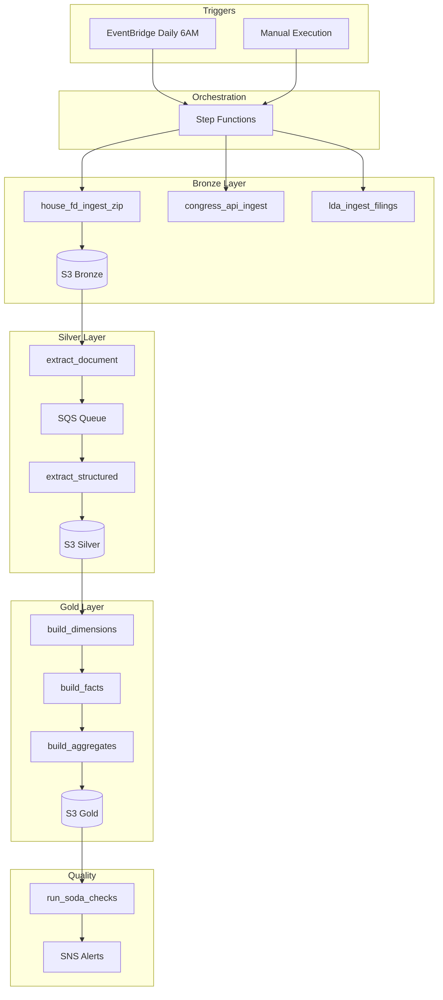

# STORY-010: Create Pipeline Architecture Mermaid Diagram

**Epic**: EPIC-001 | **Sprint**: Sprint 1 | **Points**: 2 | **Priority**: P2 | **Status**: To Do

## User Story
**As a** developer
**I want** a visual pipeline architecture diagram
**So that** I understand the overall system design

## Acceptance Criteria

### Scenario 1: Diagram shows all components
- **GIVEN** Mermaid diagram in `docs/agile/diagrams/pipeline_architecture.md`
- **WHEN** I view the diagram
- **THEN** It shows: EventBridge, Step Functions, Lambda, S3, SQS, SNS
- **AND** Data flow from triggers → Bronze → Silver → Gold
- **AND** All 29 Lambda functions categorized by phase

## Technical Tasks
- [x] Create `docs/agile/diagrams/` directory
- [x] Design Mermaid diagram structure
- [x] Include all AWS services
- [x] Show data flow with arrows
- [x] Add color coding by layer (Bronze=blue, Silver=green, Gold=yellow)
- [x] Include legend

## Mermaid Diagram Structure

## Estimated Effort: 2 hours

**Target**: Dec 19, 2025
