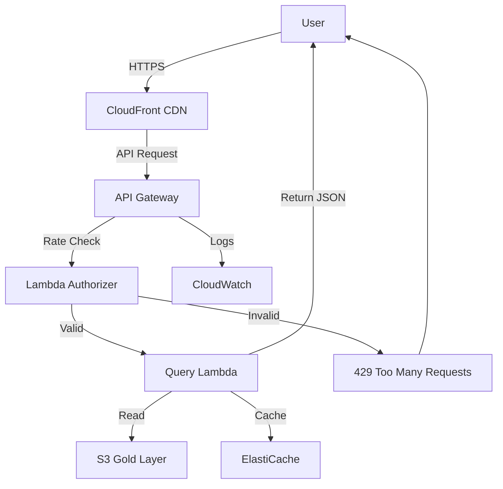

# Public API Strategy & Data Access

Strategy for making Congress financial disclosure data publicly accessible while maintaining legal compliance, managing costs, and preventing abuse.

## Table of Contents

- [Goals & Principles](#goals--principles)
- [Architecture Options](#architecture-options)
- [Phase 1: Read-Only S3 Access](#phase-1-read-only-s3-access)
- [Phase 2: REST API with Rate Limiting](#phase-2-rest-api-with-rate-limiting)
- [Phase 3: GraphQL API](#phase-3-graphql-api)
- [Authentication & Authorization](#authentication--authorization)
- [Rate Limiting Strategy](#rate-limiting-strategy)
- [Legal Compliance](#legal-compliance)
- [Community Contributions](#community-contributions)

---

## Goals & Principles

### Primary Goals

1. **Open Access**: Make data freely available for transparency and research
2. **Legal Compliance**: Ensure all use cases comply with 5 U.S.C. § 13107
3. **Sustainability**: Minimize costs while serving the community
4. **Abuse Prevention**: Prevent malicious use without hindering legitimate access
5. **Community-Driven**: Enable contributions of analyses and visualizations

### Design Principles

- **Free by Default**: No paywalls for basic access
- **Progressive Enhancement**: Start simple, add features based on demand
- **Self-Service**: Documentation and tools for DIY access
- **Open Source**: All API code and specs published
- **Federated**: Support self-hosting and distributed instances

---

## Architecture Options

### Option 1: Direct S3 Access (Phase 1)

**Pros:**
- Zero API infrastructure costs
- Highest performance (direct S3)
- Full dataset access
- Easy for technical users

**Cons:**
- Requires AWS knowledge
- No built-in rate limiting
- Difficult for non-technical users
- Limited to AWS regions

**Use Cases:**
- Researchers bulk downloading data
- Data scientists with AWS experience
- Organizations running their own analyses

### Option 2: REST API (Phase 2)

**Pros:**
- Standard HTTP interface
- Works from any programming language
- Built-in rate limiting
- No AWS knowledge required

**Cons:**
- Infrastructure costs (API Gateway, Lambda)
- Development and maintenance effort
- Potential scaling challenges

**Use Cases:**
- Web applications
- Mobile apps
- Simple integrations
- Non-technical users

### Option 3: GraphQL API (Phase 3)

**Pros:**
- Flexible querying
- Reduce over-fetching
- Strong typing
- Efficient for complex queries

**Cons:**
- Higher complexity
- Steeper learning curve
- Query cost unpredictability

**Use Cases:**
- Complex filtering and joins
- Real-time dashboards
- Advanced research queries

---

## Phase 1: Read-Only S3 Access

### Implementation

**Public S3 Bucket** (read-only):

```hcl
# In s3.tf
resource "aws_s3_bucket_policy" "public_gold_access" {
  bucket = aws_s3_bucket.data_lake.id

  policy = jsonencode({
    Version = "2012-10-17"
    Statement = [
      {
        Sid    = "PublicReadGoldLayer"
        Effect = "Allow"
        Principal = "*"
        Action = [
          "s3:GetObject",
          "s3:ListBucket"
        ]
        Resource = [
          "${aws_s3_bucket.data_lake.arn}/gold/*",
          aws_s3_bucket.data_lake.arn
        ]
        Condition = {
          StringLike = {
            "s3:prefix" = ["gold/*"]
          }
        }
      }
    ]
  })
}
```

### Access Patterns

**List Available Data:**
```bash
aws s3 ls s3://congress-disclosures-public/gold/house/financial/ --no-sign-request
```

**Download Parquet File:**
```bash
aws s3 cp s3://congress-disclosures-public/gold/house/financial/filings_flat/year=2025/part-0000.parquet . --no-sign-request
```

**Python Access:**
```python
import pandas as pd
import s3fs

# Anonymous access
s3 = s3fs.S3FileSystem(anon=True)

# Read Parquet directly
df = pd.read_parquet(
    's3://congress-disclosures-public/gold/house/financial/filings_flat/year=2025/part-0000.parquet',
    filesystem=s3
)

print(df.head())
```

### Documentation

Create `docs/DATA_ACCESS.md` with:
- S3 bucket structure
- File formats (Parquet schemas)
- Example queries
- Programming language examples (Python, R, JavaScript)

### Cost Management

**Egress costs**:
- First 100 GB/month: Free (AWS free tier)
- After: $0.09/GB

**Mitigation**:
- Encourage CloudFront caching
- Suggest self-hosting for heavy users
- Provide dataset size estimates

---

## Phase 2: REST API with Rate Limiting

### Architecture



### Endpoints

**Base URL**: `https://api.congress-disclosures.org/v1/`

#### GET /filings

List financial disclosure filings.

**Query Parameters:**
- `year` (int): Filing year
- `state` (string): State code (e.g., CA)
- `filing_type` (string): Filing type code
- `limit` (int, default=100, max=1000): Results per page
- `offset` (int): Pagination offset

**Example:**
```bash
curl "https://api.congress-disclosures.org/v1/filings?year=2025&state=CA&limit=10"
```

**Response:**
```json
{
  "data": [
    {
      "doc_id": "8221216",
      "year": 2025,
      "filing_date": "2025-05-15",
      "first_name": "NANCY",
      "last_name": "PELOSI",
      "state_district": "CA11",
      "filing_type": "A"
    }
  ],
  "pagination": {
    "total": 156,
    "limit": 10,
    "offset": 0,
    "next": "/v1/filings?year=2025&state=CA&limit=10&offset=10"
  },
  "metadata": {
    "api_version": "1.0.0",
    "timestamp": "2025-11-24T20:00:00Z"
  }
}
```

#### GET /filings/{doc_id}

Get single filing details.

**Example:**
```bash
curl "https://api.congress-disclosures.org/v1/filings/8221216"
```

#### GET /text/{doc_id}

Get extracted text from PDF.

**Example:**
```bash
curl "https://api.congress-disclosures.org/v1/text/8221216"
```

### Implementation

**Technology Stack:**
- **API Gateway**: HTTP API (cheaper than REST API)
- **Lambda**: Python 3.11 with FastAPI
- **ElastiCache Redis**: Rate limiting state
- **CloudFront**: CDN for caching

**Lambda Handler (FastAPI):**
```python
from fastapi import FastAPI, Query, HTTPException
from mangum import Mangum
import boto3

app = FastAPI(title="Congress Disclosures API")

@app.get("/v1/filings")
async def list_filings(
    year: int = Query(..., ge=2008, le=2100),
    limit: int = Query(100, ge=1, le=1000),
    offset: int = Query(0, ge=0),
):
    # Query Parquet files from S3
    # Apply filters
    # Return paginated results
    pass

# AWS Lambda handler
handler = Mangum(app)
```

---

## Rate Limiting Strategy

### Tiers

| Tier | Rate Limit | Use Case | Authentication |
|------|-----------|----------|----------------|
| **Anonymous** | 100 requests/hour | Casual browsing | None |
| **Registered** | 1,000 requests/hour | Research, apps | API key |
| **Research** | 10,000 requests/hour | Academic research | API key + verification |
| **Self-Hosted** | Unlimited | Organizations | N/A (own infrastructure) |

### Implementation

**API Gateway Throttling:**
```hcl
resource "aws_api_gateway_usage_plan" "free_tier" {
  name = "Free Tier"

  api_stages {
    api_id = aws_api_gateway_rest_api.main.id
    stage  = aws_api_gateway_stage.production.stage_name
  }

  throttle_settings {
    burst_limit = 200
    rate_limit  = 100  # requests per second
  }

  quota_settings {
    limit  = 100
    period = "HOUR"
  }
}
```

**Redis-based (for custom logic):**
```python
import redis
from datetime import datetime, timedelta

redis_client = redis.Redis(host='redis-endpoint')

def check_rate_limit(api_key: str, limit: int = 100, window: int = 3600):
    """Check if API key is within rate limit."""
    key = f"rate_limit:{api_key}"
    current = redis_client.get(key)

    if current and int(current) >= limit:
        return False  # Rate limit exceeded

    # Increment counter
    pipe = redis_client.pipeline()
    pipe.incr(key)
    pipe.expire(key, window)
    pipe.execute()

    return True
```

### Headers

**Rate Limit Headers:**
```http
X-RateLimit-Limit: 100
X-RateLimit-Remaining: 87
X-RateLimit-Reset: 1700000000
```

**Response (429 Too Many Requests):**
```json
{
  "error": {
    "code": "RATE_LIMIT_EXCEEDED",
    "message": "Rate limit exceeded. Try again in 45 minutes.",
    "retry_after": 2700
  }
}
```

---

## Authentication & Authorization

### API Key Generation

**Registration Flow:**
1. User visits `https://congress-disclosures.org/api/register`
2. Provides email, name, use case
3. Agrees to terms (5 U.S.C. § 13107 compliance)
4. Receives API key via email

**API Key Format:**
```
cd_live_abc123def456ghi789jkl012mno345pqr678
^   ^    ^
|   |    Random 36-char string
|   Environment (live, test)
|   Prefix
```

### Usage

**Request Header:**
```http
GET /v1/filings?year=2025
Host: api.congress-disclosures.org
X-API-Key: cd_live_abc123def456ghi789jkl012mno345pqr678
```

### Key Management

**Storage**: AWS Secrets Manager or DynamoDB

**Revocation**: Web dashboard for users to regenerate keys

---

## Legal Compliance

### Terms of Service

All API users must agree to:

1. **Permitted Uses Only**: Transparency, research, news/media
2. **Prohibited Uses**: Commercial (except news), credit rating, solicitation
3. **Attribution**: Cite data source
4. **No Warranty**: Data may contain errors

### Enforcement

**Monitoring**:
- Track API usage patterns
- Flag potential prohibited uses (e.g., credit score endpoints)
- Manual review of high-volume users

**Penalties**:
- Warning for first violation
- Temporary suspension for repeat violations
- Permanent ban for egregious violations

---

## Community Contributions

### Gold Layer Extensions

Enable community to contribute additional analyses:

**Example: Insider Trading Detection**
```
gold/community/insider_trading/
  methodology.md
  suspicious_trades.parquet
  model.pkl
```

**Contribution Process:**
1. Fork repository
2. Add analysis code to `gold_transformations/`
3. Submit PR with:
   - Code implementing transformation
   - Tests validating results
   - Documentation of methodology
   - Sample output
4. Maintainers review for:
   - Code quality
   - Legal compliance
   - Usefulness
5. Merge and deploy to gold layer

### API for Community Analyses

```http
GET /v1/community/insider-trading?year=2025
GET /v1/community/network-analysis/lobbying-connections
```

---

## Cost Projections

### Phase 1 (S3 Only)

**Monthly Cost**: $10-50
- S3 storage: $5
- S3 egress (1 TB): $90 → Use CloudFront to reduce
- Total: ~$10-15 with caching

### Phase 2 (REST API)

**Monthly Cost**: $50-200
- API Gateway: $3.50 per million requests
- Lambda: $0.20 per million requests
- ElastiCache (t3.micro): $10/month
- CloudFront: $10-50 (based on traffic)

**Break-even**: ~100k API requests/month

### Scaling Threshold

If costs exceed $200/month:
- Consider sponsorships/donations
- Add optional paid tiers for high-volume users
- Seek grant funding (e.g., Knight Foundation, Mozilla)

---

## Implementation Roadmap

### Q1 2026: Phase 1
- [ ] Configure public S3 access (gold layer only)
- [ ] Write data access documentation
- [ ] Create example notebooks (Python, R)
- [ ] Set up CloudFront distribution

### Q2 2026: Phase 2
- [ ] Design REST API spec (OpenAPI 3.0)
- [ ] Implement FastAPI Lambda handlers
- [ ] Set up API Gateway
- [ ] Implement rate limiting
- [ ] Create API documentation (Swagger UI)
- [ ] Build registration system

### Q3 2026: Phase 3
- [ ] Evaluate GraphQL demand
- [ ] Design GraphQL schema
- [ ] Implement with AWS AppSync or Lambda
- [ ] Migrate community analyses

---

## Questions & Feedback

This is a living document. Community input is welcome:

- **GitHub Discussions**: Propose API features
- **GitHub Issues**: Report bugs or request features
- **Email**: api@congress-disclosures.org (if we set up domain)

---

**Remember**: The goal is maximum transparency while staying legally compliant and financially sustainable. All decisions prioritize open access and community benefit.
